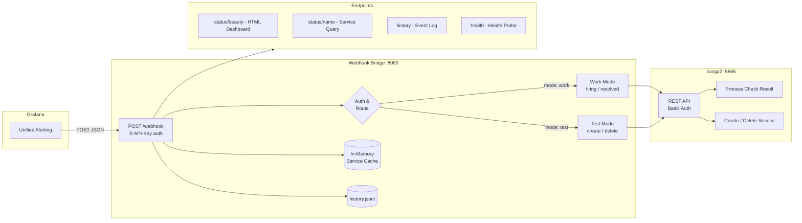
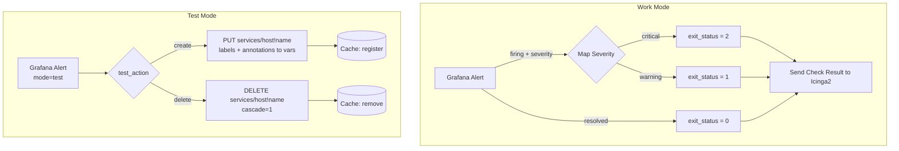

# IcingaAlertForge

> **Project Status: Under Construction — Ready for Deploy**

A lightweight Go webhook bridge that receives Grafana Unified Alerting webhooks and forwards them to Icinga2 as passive check results via the REST API. Supports automatic service creation/deletion, multi-key authentication, JSONL history logging, an in-memory service cache, and a live HTML dashboard.

---

## Table of Contents

- [Architecture](#architecture)
- [Features](#features)
- [Requirements](#requirements)
- [Installation](#installation)
  - [From Source](#from-source)
  - [Docker](#docker)
  - [Test Environment](#test-environment)
- [Configuration](#configuration)
- [Usage](#usage)
  - [Sending Alerts (Work Mode)](#sending-alerts-work-mode)
  - [Test Mode (Create / Delete Services)](#test-mode-create--delete-services)
  - [Grafana Contact Point Setup](#grafana-contact-point-setup)
- [API Reference](#api-reference)
  - [Webhook Endpoint](#webhook-endpoint)
  - [Status Endpoints](#status-endpoints)
  - [History Endpoints](#history-endpoints)
  - [Health Endpoint](#health-endpoint)
- [Icinga2 REST API Integration](#icinga2-rest-api-integration)
  - [Process Check Result](#process-check-result)
  - [Create Service](#create-service)
  - [Delete Service](#delete-service)
  - [Get Service Status](#get-service-status)
- [Grafana Webhook Payload Format](#grafana-webhook-payload-format)
- [Authentication](#authentication)
- [Cache Behavior](#cache-behavior)
- [History & Logging](#history--logging)
- [Dashboard](#dashboard)
- [Project Structure](#project-structure)
- [Testing](#testing)
- [License](#license)

---

## Architecture





All Icinga2 communication uses a **single set of REST API credentials** (port 5665). No Director dependency.

---

## Features

- **Work Mode** — Forwards firing/resolved alerts as passive check results (exit status 0/1/2)
- **Test Mode** — Creates and deletes dummy passive services directly via the Icinga2 REST API
- **Multi-Key Auth** — Multiple API keys with source tracking (`WEBHOOK_KEY_*`)
- **In-Memory Cache** — TTL-based service cache prevents duplicate creation
- **JSONL History** — Every webhook event is logged with rotation and query support
- **Live Dashboard** — Dark-themed HTML dashboard at `/status/beauty` with 30s auto-refresh
- **Structured Logging** — `log/slog` with configurable JSON or text output
- **Minimal Dependencies** — Only `google/uuid` and `joho/godotenv`
- **Docker Ready** — Multi-stage build, non-root user, built-in health checks

---

## Requirements

- **Go 1.24+** (for building from source)
- **Icinga2** with REST API enabled (port 5665)
- **Grafana** with Unified Alerting enabled
- **Docker & Docker Compose** (optional, for containerized deployment)

### Icinga2 API User Permissions

The API user needs the following permissions:

```
permissions = [ "actions/process-check-result", "objects/query/Service", "objects/create/Service", "objects/delete/Service" ]
```

---

## Installation

### From Source

```bash
git clone https://github.com/your-org/IcingaAlertForge.git
cd IcingaAlertForge

# Copy and configure environment
cp .env.example .env
# Edit .env with your Icinga2 credentials and webhook keys

# Build
go build -o webhook-bridge .

# Run
./webhook-bridge
```

### Docker

```bash
# Build the image
docker build -t webhook-bridge .

# Run with your .env file
docker run -d \
  --name webhook-bridge \
  -p 8080:8080 \
  -v $(pwd)/.env:/app/.env:ro \
  -v webhook-logs:/var/log/webhook-bridge \
  webhook-bridge
```

### Docker Compose

```bash
# Configure your environment
cp .env.example .env
# Edit .env

# Start
docker compose up -d --build

# Check health
curl http://localhost:8080/health
```

### Test Environment

A complete test stack with Icinga2, Prometheus, Grafana, and the webhook bridge:

```bash
cd testenv

# Start the full monitoring stack
docker compose up -d --build

# Wait for all services to become healthy (~60s for Icinga2)
docker compose ps

# Services available:
#   Icinga2 API     → https://localhost:5665  (apiuser / apipassword)
#   Prometheus      → http://localhost:9090
#   Grafana         → http://localhost:3000   (admin / admin)
#   Webhook Bridge  → http://localhost:9080
#   Dashboard       → http://localhost:9080/status/beauty
```

**Tear down:**

```bash
cd testenv
docker compose down -v
```

---

## Configuration

All settings are loaded from environment variables or a `.env` file in the working directory.

| Variable | Required | Default | Description |
|----------|----------|---------|-------------|
| `SERVER_PORT` | No | `8080` | HTTP listen port |
| `SERVER_HOST` | No | `0.0.0.0` | HTTP listen host |
| `WEBHOOK_KEY_<NAME>` | Yes (min 1) | — | API key; `<NAME>` becomes source ID (lowercased, `_` → `-`) |
| `ICINGA2_HOST` | Yes | — | Icinga2 REST API base URL (e.g. `https://icinga2:5665`) |
| `ICINGA2_USER` | Yes | — | Icinga2 API username |
| `ICINGA2_PASS` | Yes | — | Icinga2 API password |
| `ICINGA2_HOST_NAME` | Yes | — | Target host name in Icinga2 for all service operations |
| `ICINGA2_TLS_SKIP_VERIFY` | No | `false` | Skip TLS certificate verification (development only!) |
| `HISTORY_FILE` | No | `/var/log/webhook-bridge/history.jsonl` | Path to JSONL history file |
| `HISTORY_MAX_ENTRIES` | No | `10000` | Max history entries before automatic rotation |
| `CACHE_TTL_MINUTES` | No | `60` | In-memory service cache TTL in minutes |
| `LOG_LEVEL` | No | `info` | Log level: `debug`, `info`, `warn`, `error` |
| `LOG_FORMAT` | No | `json` | Log format: `json` or `text` |

**Example `.env`:**

```bash
WEBHOOK_KEY_GRAFANA_PROD=my-secret-key-prod
WEBHOOK_KEY_GRAFANA_DEV=my-secret-key-dev

ICINGA2_HOST=https://icinga2.example.com:5665
ICINGA2_USER=apiuser
ICINGA2_PASS=secretpassword
ICINGA2_HOST_NAME=monitored-host
ICINGA2_TLS_SKIP_VERIFY=false

HISTORY_FILE=/var/log/webhook-bridge/history.jsonl
HISTORY_MAX_ENTRIES=10000
CACHE_TTL_MINUTES=60

LOG_LEVEL=info
LOG_FORMAT=json
```

---

## Usage

### Sending Alerts (Work Mode)

Work mode is the default. When Grafana fires or resolves an alert, the bridge maps it to an Icinga2 passive check result:

| Alert Status | Severity Label | Exit Status | Icinga2 State |
|-------------|---------------|------------:|---------------|
| `resolved` | any | 0 | OK |
| `firing` | `warning` | 1 | WARNING |
| `firing` | `critical` | 2 | CRITICAL |
| `firing` | (missing/other) | 2 | CRITICAL |

The `alertname` label becomes the Icinga2 service name. The `summary` annotation becomes the plugin output.

**Example — send a CRITICAL alert:**

```bash
curl -X POST http://localhost:8080/webhook \
  -H "Content-Type: application/json" \
  -H "X-API-Key: my-secret-key-prod" \
  -d '{
    "status": "firing",
    "alerts": [{
      "status": "firing",
      "labels": {"alertname": "HighCPU", "severity": "critical"},
      "annotations": {"summary": "CPU usage above 95%"}
    }]
  }'
```

**Example — resolve the alert:**

```bash
curl -X POST http://localhost:8080/webhook \
  -H "Content-Type: application/json" \
  -H "X-API-Key: my-secret-key-prod" \
  -d '{
    "status": "resolved",
    "alerts": [{
      "status": "resolved",
      "labels": {"alertname": "HighCPU", "severity": "critical"},
      "annotations": {"summary": "CPU usage back to normal"}
    }]
  }'
```

### Test Mode (Create / Delete Services)

Set `mode: "test"` and `test_action` in the alert labels to manage Icinga2 services:

**Create a test service:**

```bash
curl -X POST http://localhost:8080/webhook \
  -H "Content-Type: application/json" \
  -H "X-API-Key: my-secret-key-prod" \
  -d '{
    "status": "firing",
    "alerts": [{
      "status": "firing",
      "labels": {"alertname": "MyTestService", "mode": "test", "test_action": "create"},
      "annotations": {"summary": "Creating test service"}
    }]
  }'
```

**Delete a test service:**

```bash
curl -X POST http://localhost:8080/webhook \
  -H "Content-Type: application/json" \
  -H "X-API-Key: my-secret-key-prod" \
  -d '{
    "status": "firing",
    "alerts": [{
      "status": "firing",
      "labels": {"alertname": "MyTestService", "mode": "test", "test_action": "delete"},
      "annotations": {"summary": "Removing test service"}
    }]
  }'
```

Changes are **immediate** via the Icinga2 REST API (no deploy step). The cache prevents duplicate creation.

### Grafana Contact Point Setup

1. In Grafana, go to **Alerting** -> **Contact points**
2. Click **Add contact point**
3. Choose type: **Webhook**
4. Set URL: `http://<webhook-bridge-host>:8080/webhook`
5. Set HTTP Method: **POST**
6. Add HTTP Header: `X-API-Key` = `<your WEBHOOK_KEY value>`
7. Save and test

---

## API Reference

### Webhook Endpoint

#### `POST /webhook`

Main endpoint for receiving Grafana alert webhooks.

**Request Headers:**

| Header | Required | Description |
|--------|----------|-------------|
| `X-API-Key` | Yes | Webhook API key for authentication |
| `Content-Type` | Yes | Must be `application/json` |

**Request Body:** See [Grafana Webhook Payload Format](#grafana-webhook-payload-format)

**Response `200 OK`:**

```json
{
  "request_id": "550e8400-e29b-41d4-a716-446655440000",
  "source": "grafana-prod",
  "results": [
    {
      "status": "processed",
      "service": "HighCPU",
      "exit_status": 2,
      "label": "CRITICAL",
      "icinga_ok": true,
      "duration_ms": 45
    }
  ]
}
```

**Possible result `status` values:**

| Status | Mode | Description |
|--------|------|-------------|
| `processed` | work | Alert forwarded to Icinga2 as check result |
| `created` | test | Service created in Icinga2 |
| `deleted` | test | Service deleted from Icinga2 |
| `already_exists` | test | Service already cached, creation skipped |
| `error` | any | Operation failed (see `error` field) |

**Error Responses:**

| HTTP Code | Reason |
|-----------|--------|
| `400` | Invalid JSON or empty alerts array |
| `401` | Missing or invalid `X-API-Key` header |
| `405` | HTTP method is not POST |

---

### Status Endpoints

#### `GET /status/beauty`

Live HTML dashboard with statistics, recent alerts, errors, and cached services. Auto-refreshes every 30 seconds. See [Dashboard](#dashboard) for details.

#### `GET /status/{service_name}`

Query the current state of a specific service from both the internal cache and Icinga2.

**Response `200 OK`:**

```json
{
  "service": "HighCPU",
  "cache_state": "ready",
  "exists_in_icinga": true,
  "last_check_result": {
    "exit_status": 0,
    "output": "OK: CPU usage back to normal",
    "timestamp": "2026-03-18T12:34:56Z"
  }
}
```

**Cache states:** `not_found` | `pending` | `ready` | `pending_delete`

---

### History Endpoints

#### `GET /history`

Query webhook event history with optional filters.

**Query Parameters:**

| Parameter | Type | Default | Description |
|-----------|------|---------|-------------|
| `limit` | int | `100` | Max entries to return |
| `service` | string | — | Filter by service name |
| `source` | string | — | Filter by source key (e.g. `grafana-prod`) |
| `mode` | string | — | Filter by `test` or `work` |
| `from` | string | — | Start date (`2006-01-02` or RFC3339) |
| `to` | string | — | End date (`2006-01-02` or RFC3339) |

**Response `200 OK`:**

```json
{
  "entries": [
    {
      "timestamp": "2026-03-18T12:34:56Z",
      "request_id": "550e8400-...",
      "source_key": "grafana-prod",
      "mode": "work",
      "action": "firing",
      "service_name": "HighCPU",
      "severity": "critical",
      "exit_status": 2,
      "message": "CRITICAL: CPU usage above 95%",
      "icinga_ok": true,
      "duration_ms": 45,
      "error": ""
    }
  ],
  "count": 1,
  "filters": {
    "limit": 100,
    "service": "",
    "source": "",
    "mode": ""
  }
}
```

#### `GET /history/export`

Download the full JSONL history file as an attachment.

- **Content-Type:** `application/x-ndjson`
- **Content-Disposition:** `attachment; filename="webhook-history.jsonl"`

---

### Health Endpoint

#### `GET /health`

Returns service health status. Used by Docker health checks and load balancers.

```json
{"status":"ok","version":"1.0.0"}
```

---

## Icinga2 REST API Integration

All Icinga2 communication uses the **REST API on port 5665** with HTTP Basic Authentication. A single set of credentials (`ICINGA2_USER` / `ICINGA2_PASS`) handles all operations.

### Process Check Result

Sends a passive check result for an existing service. Used in **work mode**.

```
POST {ICINGA2_HOST}/v1/actions/process-check-result
```

**Request Headers:**
```
Authorization: Basic <base64(user:pass)>
Content-Type: application/json
Accept: application/json
```

**Request Body:**
```json
{
  "type": "Service",
  "filter": "host.name==\"test-host\" && service.name==\"HighCPU\"",
  "exit_status": 2,
  "plugin_output": "CRITICAL: CPU usage above 95%"
}
```

**Exit Status Values:**

| Value | Icinga2 State |
|------:|---------------|
| 0 | OK |
| 1 | WARNING |
| 2 | CRITICAL |
| 3 | UNKNOWN |

---

### Create Service

Creates a dummy passive service in Icinga2. Used in **test mode** (`test_action: "create"`).

```
PUT {ICINGA2_HOST}/v1/objects/services/{host}!{service_name}
```

**Request Body:**
```json
{
  "attrs": {
    "check_command": "dummy",
    "enable_active_checks": false,
    "enable_passive_checks": true,
    "check_interval": 300,
    "max_check_attempts": 1,
    "display_name": "MyTestService - CPU usage above 90%",
    "notes": "CPU usage above 90%\nServer has high CPU for 5 minutes",
    "notes_url": "https://wiki.example.com/runbooks/cpu-high",
    "action_url": "https://grafana.example.com/d/panel-url",
    "vars": {
      "grafana_label_alertname": "MyTestService",
      "grafana_label_severity": "critical",
      "grafana_label_team": "infra",
      "grafana_annotation_summary": "CPU usage above 90%",
      "grafana_annotation_description": "Server has high CPU for 5 minutes",
      "grafana_annotation_runbook_url": "https://wiki.example.com/runbooks/cpu-high"
    }
  },
  "templates": ["generic-service"]
}
```

All webhook labels are stored as `vars.grafana_label_*` and annotations as `vars.grafana_annotation_*`, making the full Grafana alert context visible in the Icinga2 UI.

Changes are **immediate** — no deploy step is required.

---

### Delete Service

Removes a service from Icinga2 with cascade. Used in **test mode** (`test_action: "delete"`).

```
DELETE {ICINGA2_HOST}/v1/objects/services/{host}!{service_name}?cascade=1
```

The `cascade=1` parameter ensures related objects (comments, downtimes, etc.) are also removed.

---

### Get Service Status

Queries the current check result for a service. Used by the `/status/{service_name}` endpoint.

```
GET {ICINGA2_HOST}/v1/objects/services?filter=host.name=="{host}"&&service.name=="{service}"&attrs=last_check_result
```

**Response fields used:**
- `results[0].attrs.last_check_result.exit_status` — Current state
- `results[0].attrs.last_check_result.output` — Plugin output string
- `results[0].attrs.last_check_result.execution_end` — Unix timestamp of last check

---

## Grafana Webhook Payload Format

The bridge accepts the standard [Grafana Unified Alerting webhook format](https://grafana.com/docs/grafana/latest/alerting/configure-notifications/manage-contact-points/integrations/webhook-notifier/):

```json
{
  "status": "firing",
  "alerts": [
    {
      "status": "firing",
      "labels": {
        "alertname": "HighCPU",
        "severity": "critical",
        "mode": "test",
        "test_action": "create"
      },
      "annotations": {
        "summary": "CPU usage above 95%"
      },
      "startsAt": "2026-03-18T12:00:00Z",
      "endsAt": "0001-01-01T00:00:00Z"
    }
  ]
}
```

### Labels

| Label | Required | Values | Description |
|-------|----------|--------|-------------|
| `alertname` | **Yes** | any string | Becomes the Icinga2 service name |
| `severity` | No | `critical`, `warning` | Maps to exit status; defaults to `critical` if absent |
| `mode` | No | `test` | Enables test mode (service CRUD); omit for work mode |
| `test_action` | No | `create`, `delete` | Action to perform in test mode |

### Annotations

| Annotation | Required | Description |
|------------|----------|-------------|
| `summary` | No | Used as plugin output message in Icinga2 |

---

## Authentication

The bridge uses API key authentication via the `X-API-Key` HTTP header.

Keys are configured through environment variables with the `WEBHOOK_KEY_` prefix:

```bash
WEBHOOK_KEY_GRAFANA_PROD=abc123secret        # source: "grafana-prod"
WEBHOOK_KEY_GRAFANA_DEV=dev456secret          # source: "grafana-dev"
WEBHOOK_KEY_MONITORING_SCRIPT=script789       # source: "monitoring-script"
```

**Name transformation rules:**
1. Strip the `WEBHOOK_KEY_` prefix
2. Lowercase the remainder
3. Replace underscores (`_`) with hyphens (`-`)

The resolved source name is recorded in every history entry for auditing.

At least one `WEBHOOK_KEY_*` variable must be set or the application will refuse to start.

---

## Cache Behavior

An in-memory TTL cache tracks service states to prevent duplicate API calls in test mode.

| State | Description |
|-------|-------------|
| `not_found` | Unknown or TTL-expired service |
| `pending` | Creation initiated, waiting for confirmation |
| `ready` | Service exists and is active in Icinga2 |
| `pending_delete` | Deletion in progress |

- **TTL:** Configurable via `CACHE_TTL_MINUTES` (default: 60 min)
- **Deduplication:** Test-mode `create` checks cache first — skips the API call if the service exists
- **Thread-safe:** Protected by `sync.RWMutex`
- **Visibility:** Current cache contents are displayed on the `/status/beauty` dashboard and queryable via `/status/{service_name}`

---

## History & Logging

### JSONL History

Every webhook event is appended as a single JSON line to the history file:

```json
{
  "timestamp": "2026-03-18T12:34:56Z",
  "request_id": "550e8400-e29b-41d4-a716-446655440000",
  "source_key": "grafana-prod",
  "mode": "work",
  "action": "firing",
  "service_name": "HighCPU",
  "severity": "critical",
  "exit_status": 2,
  "message": "CRITICAL: CPU usage above 95%",
  "icinga_ok": true,
  "duration_ms": 45,
  "error": ""
}
```

**Rotation:** When `HISTORY_MAX_ENTRIES` is exceeded, the oldest entries are automatically trimmed asynchronously.

**Querying:** Use `GET /history` with filters or `GET /history/export` to download the raw file.

### Structured Application Logs

Application logs use Go's `log/slog`:

```bash
LOG_LEVEL=info    # debug | info | warn | error
LOG_FORMAT=json   # json | text
```

---

## Dashboard

The `/status/beauty` endpoint serves a self-contained HTML dashboard with no external dependencies:

| Section | Content |
|---------|---------|
| **Summary Cards** | Total webhooks, error count, average duration, cached services count |
| **Mode Breakdown** | Work mode vs test mode event counts |
| **Severity Breakdown** | Critical vs warning alert counts |
| **Sources** | All webhook sources with per-source event counts |
| **Cached Services** | All tracked services with color-coded state badges (green=ready, yellow=pending, red=pending_delete) |
| **Recent Alerts** | Last 20 events — time, status, mode, action, service, source, Icinga result, duration |
| **Recent Errors** | Last 10 failed events with error messages |

- **Theme:** Dark (GitHub-inspired)
- **Auto-refresh:** Every 30 seconds
- **No external JS/CSS** — fully self-contained HTML

---

## Project Structure

```
IcingaAlertForge/
├── main.go                     # Entry point, route registration, server setup
├── Dockerfile                  # Multi-stage production build (golang:1.24 → alpine:3.19)
├── docker-compose.yml          # Production deployment
├── .env.example                # Environment variable template
├── go.mod                      # Go module (google/uuid, godotenv)
├── go.sum
│
├── config/
│   ├── config.go               # Loads and validates all environment config
│   └── config_test.go
│
├── auth/
│   ├── apikey.go               # API key store and validation
│   └── apikey_test.go
│
├── models/
│   ├── grafana.go              # GrafanaPayload, GrafanaAlert structs + helpers
│   └── history.go              # HistoryEntry struct
│
├── icinga/
│   ├── api.go                  # Icinga2 REST API client (check results + CRUD)
│   └── api_test.go
│
├── cache/
│   ├── services.go             # In-memory TTL service cache (sync.RWMutex)
│   └── services_test.go
│
├── handler/
│   ├── webhook.go              # POST /webhook — main handler, auth, routing
│   ├── work_mode.go            # Firing/resolved → passive check results
│   ├── test_mode.go            # Create/delete services via Icinga2 REST API
│   ├── status.go               # GET /status/{service_name}
│   ├── dashboard.go            # GET /status/beauty — HTML dashboard
│   ├── history_helper.go       # logHistory() convenience method
│   ├── webhook_test.go
│   └── work_mode_test.go
│
├── history/
│   ├── logger.go               # Thread-safe JSONL logger with rotation & stats
│   ├── handler.go              # GET /history + GET /history/export
│   └── logger_test.go
│
└── testenv/                    # Complete test environment
    ├── docker-compose.yml      # Icinga2 + Prometheus + Grafana + Bridge
    ├── .env.test               # Test configuration
    ├── icinga2/
    │   ├── Dockerfile          # Custom Icinga2 image with API + TLS certs
    │   └── conf.d/
    │       ├── api-users.conf  # API user definition
    │       └── hosts.conf      # Test host object
    ├── prometheus/
    │   └── prometheus.yml
    └── grafana/
        ├── provisioning/       # Datasource and dashboard provisioning
        └── dashboards/
```

---

## Testing

### Unit Tests

```bash
# Run all tests with race detector
go test -race -count=1 ./...

# Verbose output
go test -v ./...

# Single package
go test -v ./handler/...
go test -v ./icinga/...

# With coverage report
go test -coverprofile=coverage.out ./...
go tool cover -html=coverage.out
```

### Test Coverage

| Package | What is tested |
|---------|---------------|
| `auth` | Valid/invalid keys, multiple keys |
| `cache` | States, TTL expiry, thread safety |
| `config` | Valid config, missing vars, no keys, custom values, TLS flag |
| `handler` | Auth (no key, wrong key), bad JSON, empty alerts, method check, firing (critical/warning), resolved, test mode (create/delete), cache deduplication, multiple keys |
| `history` | Append, query with filters, stats aggregation, rotation |
| `icinga` | SendCheckResult, CreateService, DeleteService (success + error), basic auth verification |

### End-to-End Testing

```bash
cd testenv
docker compose up -d --build

# Wait for Icinga2 health check to pass (~60s)
docker compose ps

# Send a CRITICAL alert
curl -s -X POST http://localhost:9080/webhook \
  -H "Content-Type: application/json" \
  -H "X-API-Key: test-key-grafana-local" \
  -d '{
    "status": "firing",
    "alerts": [{
      "status": "firing",
      "labels": {"alertname": "HighCPU", "severity": "critical"},
      "annotations": {"summary": "CPU usage above 95%"}
    }]
  }' | jq .

# Check Icinga2 directly
curl -sk -u apiuser:apipassword \
  'https://localhost:5665/v1/objects/services?filter=service.name=="HighCPU"&attrs=last_check_result' | jq .

# View the dashboard
open http://localhost:9080/status/beauty

# Query history
curl -s 'http://localhost:9080/history?service=HighCPU' | jq .

# Clean up
docker compose down -v
```

---

## License

MIT
