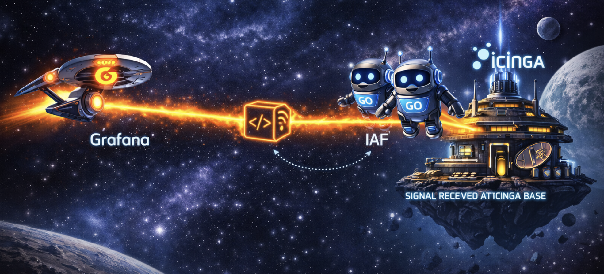
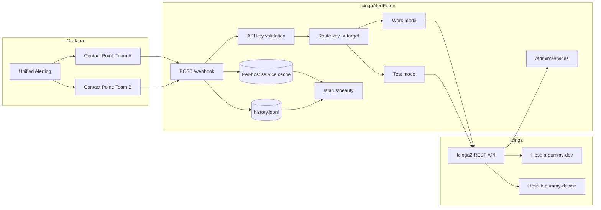
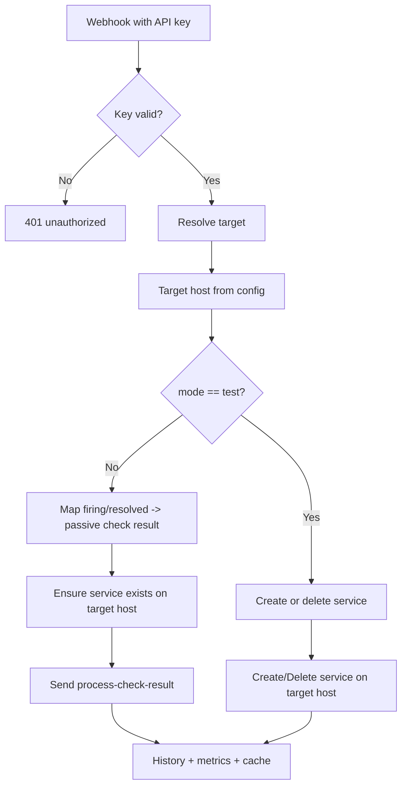

# IcingaAlertForge

> Go webhook bridge from Grafana Unified Alerting to Icinga2 passive checks, with multi-team routing, dynamic dummy hosts, per-target notification policy, admin APIs, JSONL history, and an LCARS-style beauty panel.



---

## Table of Contents

- [Overview](#overview)
- [Architecture](#architecture)
- [Features](#features)
- [Requirements](#requirements)
- [Installation](#installation)
- [Configuration](#configuration)
  - [Core Settings](#core-settings)
  - [Target Model](#target-model)
  - [Target Variables](#target-variables)
  - [Naming And Routing Rules](#naming-and-routing-rules)
  - [Multi-Team Example](#multi-team-example)
  - [Legacy Compatibility](#legacy-compatibility)
  - [Migration From Legacy To Targets](#migration-from-legacy-to-targets)
  - [What Gets Written Into Icinga](#what-gets-written-into-icinga)
- [Usage](#usage)
  - [Work Mode](#work-mode)
  - [Test Mode](#test-mode)
  - [Grafana Contact Points Per Team](#grafana-contact-points-per-team)
- [API Reference](#api-reference)
  - [Webhook Endpoint](#webhook-endpoint)
  - [Admin Endpoints](#admin-endpoints)
  - [Status Endpoints](#status-endpoints)
  - [History Endpoints](#history-endpoints)
  - [Health Endpoint](#health-endpoint)
- [Icinga Integration Details](#icinga-integration-details)
  - [Dynamic Host Creation](#dynamic-host-creation)
  - [Service Creation](#service-creation)
  - [Notification Routing Vars](#notification-routing-vars)
  - [Managed Markers And Ghost Cleanup](#managed-markers-and-ghost-cleanup)
- [Cache Behavior](#cache-behavior)
- [History And Logging](#history-and-logging)
- [Beauty Panel](#beauty-panel)
- [Test Environment](#test-environment)
  - [Resetting And Cleanup](#resetting-and-cleanup)
  - [Capturing Beauty Panel Screenshots](#capturing-beauty-panel-screenshots)
- [Project Structure](#project-structure)
- [Testing](#testing)
- [Operational Notes](#operational-notes)

---

## Overview

IcingaAlertForge receives Grafana webhooks, authenticates them with API keys, resolves the target team/device, auto-creates the target host or service in Icinga2 when needed, and submits passive check results through the Icinga2 REST API.

The current design is no longer limited to one dummy device. You can now define multiple managed dummy hosts in configuration, assign multiple webhook keys to each host, and attach a host-level notification policy per target. This is intended for setups where different teams have their own webhook keys, their own dummy devices in Icinga, and their own notification recipients or user groups.

This is a hobby project. It is developed and maintained mainly on weekends, so releases, fixes, and larger changes usually arrive in batches rather than on a strict schedule.

Examples:

- Team A webhook keys route to `a-dummy-dev`
- Team B webhook keys route to `b-dummy-device`
- Team A can notify users `alpha,omega`
- Team B can notify groups `sms-beta,sms-ceta`
- Both teams can restrict notifications to `critical` only

The bridge still supports the legacy single-host model, but the multi-target configuration is the preferred model going forward.

---

## Architecture





Key properties of the current architecture:

- one global Icinga2 API client
- multiple configured targets
- one or more API keys per target
- service cache keyed by `host + service`
- history entries include `source_key` and `host_name`
- admin and beauty panel aggregate across all configured targets

---

## Features

- Multi-target routing with many dummy hosts defined in configuration
- Multiple API keys per target/device
- Per-target notification policy for users, groups, service states, and host states
- Dynamic dummy host creation on startup
- Dynamic service creation in work mode
- Test mode for service create/delete through webhook
- JSONL history with query filters
- Per-host service cache with TTL and cleanup
- Admin API for listing and deleting services across all targets
- LCARS-style beauty panel with admin mode and service management
- Structured logging and runtime metrics
- Test environment with Icinga2, Icinga Web 2, Grafana, Prometheus, and synthetic flapping alerts

---

## Requirements

- Go 1.24+
- Icinga2 with REST API enabled on port `5665`
- Grafana Unified Alerting
- Docker and Compose for containerized deployment or the bundled `testenv`

### Icinga2 API Permissions

The API user must be allowed to:

```conf
permissions = [
  "actions/process-check-result",
  "objects/query/Service",
  "objects/create/Service",
  "objects/delete/Service",
  "objects/query/Host",
  "objects/create/Host"
]
```

If you auto-create hosts, `objects/query/Host` and `objects/create/Host` are required.

---

## Installation

### From Source

```bash
git clone https://github.com/your-org/IcingaAlertForge.git
cd IcingaAlertForge

cp .env.example .env
# edit .env

go build -o webhook-bridge .
./webhook-bridge
```

### Docker

```bash
docker build -t webhook-bridge .

docker run -d \
  --name webhook-bridge \
  -p 8080:8080 \
  --env-file .env \
  -v webhook-logs:/var/log/webhook-bridge \
  webhook-bridge
```

### Docker Compose

```bash
docker compose up -d --build
```

If your Docker installation still uses the legacy binary, `docker-compose` works as well.

---

## Configuration

All configuration is read from environment variables or a local `.env`.

### Core Settings

| Variable | Required | Default | Description |
|---|---|---|---|
| `SERVER_PORT` | No | `8080` | HTTP port |
| `SERVER_HOST` | No | `0.0.0.0` | HTTP bind address |
| `ICINGA2_HOST` | Yes | — | Icinga2 API base URL, for example `https://icinga2.example.com:5665` |
| `ICINGA2_USER` | Yes | — | Icinga2 API user |
| `ICINGA2_PASS` | Yes | — | Icinga2 API password |
| `ICINGA2_HOST_AUTO_CREATE` | No | `false` | Auto-create configured target hosts when missing |
| `ICINGA2_TLS_SKIP_VERIFY` | No | `false` | Skip TLS verification |
| `HISTORY_FILE` | No | `/var/log/webhook-bridge/history.jsonl` | JSONL history file |
| `HISTORY_MAX_ENTRIES` | No | `10000` | Rotation limit for history |
| `CACHE_TTL_MINUTES` | No | `60` | TTL for per-host service cache |
| `LOG_LEVEL` | No | `info` | `debug`, `info`, `warn`, `error` |
| `LOG_FORMAT` | No | `json` | `json` or `text` |
| `ADMIN_USER` | No | `admin` | Admin username |
| `ADMIN_PASS` | No | empty | Admin password; if empty, admin APIs are disabled |
| `RATELIMIT_MUTATE_MAX` | No | `5` | Concurrent create/delete operations |
| `RATELIMIT_STATUS_MAX` | No | `20` | Concurrent status update operations |
| `RATELIMIT_MAX_QUEUE` | No | `100` | Max queued status jobs |

### Target Model

Each target is one managed dummy host in Icinga2 plus its webhook routing and notification policy.

The target identifier is derived from the environment variable name:

- `IAF_TARGET_TEAM_A_*` becomes target ID `team-a`
- `IAF_TARGET_B_DUMMY_DEVICE_*` becomes target ID `b-dummy-device`

The target ID and the human-visible `SOURCE` are not required to match.

Example:

```env
IAF_TARGET_TEAM_A_HOST_NAME=a-dummy-dev
IAF_TARGET_TEAM_A_SOURCE=alerts-dev-a
```

This means:

- target ID = `team-a`
- source shown in history/logs = `alerts-dev-a`

If `SOURCE` is omitted, it defaults to the normalized target ID.

### Target Variables

| Variable | Required | Default | Description |
|---|---|---|---|
| `IAF_TARGET_<ID>_HOST_NAME` | Yes | — | Icinga host name created/used for that target |
| `IAF_TARGET_<ID>_HOST_DISPLAY` | No | `<HOST_NAME>` | Host display name |
| `IAF_TARGET_<ID>_HOST_ADDRESS` | No | empty | Optional metadata stored as `vars.iaf_host_address`; not written to `address` |
| `IAF_TARGET_<ID>_API_KEYS` | Yes | — | Comma-separated webhook keys assigned to this target |
| `IAF_TARGET_<ID>_SOURCE` | No | normalized target ID | Source label recorded in logs/history |
| `IAF_TARGET_<ID>_NOTIFICATION_USERS` | No | empty | Comma-separated Icinga users |
| `IAF_TARGET_<ID>_NOTIFICATION_GROUPS` | No | empty | Comma-separated Icinga groups/user_groups |
| `IAF_TARGET_<ID>_NOTIFICATION_SERVICE_STATES` | No | empty | Comma-separated service states, for example `critical,warning` |
| `IAF_TARGET_<ID>_NOTIFICATION_HOST_STATES` | No | empty | Comma-separated host states, for example `down` |

Important behavior:

- `API_KEYS` are global secrets and must be unique across all targets
- multiple keys may point to the same target
- a single incoming key resolves to exactly one target host
- `NOTIFICATION_GROUPS` is written into both `groups` and `user_groups` custom vars to make group-based apply rules easier

### Naming And Routing Rules

The configuration model has four different names that are easy to confuse:

| Concept | Example | Where it comes from | What it is used for |
|---|---|---|---|
| Target ID | `team-a` | normalized from `IAF_TARGET_TEAM_A_*` | internal routing key, logs, default source |
| Source | `team-a` or `alerts-dev-a` | `IAF_TARGET_TEAM_A_SOURCE` | history, API responses, log label |
| Host name | `a-dummy-dev` | `IAF_TARGET_TEAM_A_HOST_NAME` | actual Icinga host object |
| API key | `key-a-1` | `IAF_TARGET_TEAM_A_API_KEYS` | selects the target at request time |

Practical rules:

- the env prefix defines the target ID; `TEAM_A` becomes `team-a`
- `SOURCE` is optional; if omitted, it falls back to the target ID
- `HOST_NAME` is the only name that creates or selects the Icinga dummy device
- `API_KEYS` belong to the target, not to the source string
- `NOTIFICATION_USERS` and `NOTIFICATION_GROUPS` are independent of the webhook sender; they describe who Icinga should notify for that host

Recommended convention:

- keep target ID, `SOURCE`, and host naming close to each other unless you need legacy compatibility
- treat `SOURCE` as a human-facing audit label
- treat `HOST_NAME` as the technical Icinga object name
- keep API keys globally unique across the whole deployment

Concrete example:

```env
IAF_TARGET_KONEKTS_A_SOURCE=alerts-dev-a
IAF_TARGET_KONEKTS_A_HOST_NAME=a-dummy-dev
IAF_TARGET_KONEKTS_A_API_KEYS=key-a-1,key-a-2
IAF_TARGET_KONEKTS_A_NOTIFICATION_GROUPS=sms-alfa,sms-omega
```

This means:

- target ID = `konekts-a`
- source shown in history/logs = `alerts-dev-a`
- Icinga host object = `a-dummy-dev`
- both keys route to the same dummy device and notification policy

### Multi-Team Example

The example below shows two teams with different webhook keys, different dummy devices, and different group-based notification routing:

```env
SERVER_PORT=8080
SERVER_HOST=0.0.0.0

ICINGA2_HOST=https://icinga2.example.com:5665
ICINGA2_USER=apiuser
ICINGA2_PASS=supersecret
ICINGA2_HOST_AUTO_CREATE=true
ICINGA2_TLS_SKIP_VERIFY=false

IAF_TARGET_TEAM_A_SOURCE=team-a
IAF_TARGET_TEAM_A_HOST_NAME=a-dummy-dev
IAF_TARGET_TEAM_A_HOST_DISPLAY=Team A Dummy Device
IAF_TARGET_TEAM_A_API_KEYS=key-a-1,key-a-2
IAF_TARGET_TEAM_A_NOTIFICATION_GROUPS=sms-alfa,sms-omega
IAF_TARGET_TEAM_A_NOTIFICATION_SERVICE_STATES=critical
IAF_TARGET_TEAM_A_NOTIFICATION_HOST_STATES=down

IAF_TARGET_TEAM_B_SOURCE=team-b
IAF_TARGET_TEAM_B_HOST_NAME=b-dummy-device
IAF_TARGET_TEAM_B_HOST_DISPLAY=Team B Dummy Device
IAF_TARGET_TEAM_B_API_KEYS=key-b-1,key-b-2
IAF_TARGET_TEAM_B_NOTIFICATION_GROUPS=sms-beta,sms-ceta
IAF_TARGET_TEAM_B_NOTIFICATION_SERVICE_STATES=critical
IAF_TARGET_TEAM_B_NOTIFICATION_HOST_STATES=down

ADMIN_USER=admin
ADMIN_PASS=change-me
```

If you prefer direct user routing instead of groups:

```env
IAF_TARGET_TEAM_A_NOTIFICATION_USERS=alpha,omega
IAF_TARGET_TEAM_B_NOTIFICATION_USERS=beta,ceta
```

### Legacy Compatibility

The application still supports the old single-host model:

```env
WEBHOOK_KEY_GRAFANA_PROD=secret-prod
WEBHOOK_KEY_GRAFANA_DEV=secret-dev

ICINGA2_HOST_NAME=grafana-alerts
ICINGA2_HOST_DISPLAY=Grafana Alerts
ICINGA2_HOST_ADDRESS=
```

Legacy rules:

- at least one `WEBHOOK_KEY_*` is required in legacy mode
- all keys route to one shared host
- `WEBHOOK_KEY_<NAME>` still becomes source name by lowercasing and replacing `_` with `-`

If any `IAF_TARGET_*` variables are present, the new target model is used.

### Migration From Legacy To Targets

Use this path when moving from one shared host and `WEBHOOK_KEY_*` variables to multiple managed dummy devices.

1. Pick one target per team or notification domain.
2. Create one `IAF_TARGET_<ID>_HOST_NAME` per dummy device.
3. Move each existing webhook secret into `IAF_TARGET_<ID>_API_KEYS`.
4. Decide whether the team routes by `NOTIFICATION_USERS` or `NOTIFICATION_GROUPS`.
5. Enable `ICINGA2_HOST_AUTO_CREATE=true` if the bridge should create missing hosts.
6. Remove or comment legacy `WEBHOOK_KEY_*` variables once all senders are switched.

Migration example:

```env
# old
WEBHOOK_KEY_GRAFANA_A=legacy-a
WEBHOOK_KEY_GRAFANA_B=legacy-b
ICINGA2_HOST_NAME=grafana-alerts

# new
IAF_TARGET_TEAM_A_HOST_NAME=a-dummy-dev
IAF_TARGET_TEAM_A_API_KEYS=legacy-a
IAF_TARGET_TEAM_A_NOTIFICATION_GROUPS=sms-alfa,sms-omega

IAF_TARGET_TEAM_B_HOST_NAME=b-dummy-device
IAF_TARGET_TEAM_B_API_KEYS=legacy-b
IAF_TARGET_TEAM_B_NOTIFICATION_GROUPS=sms-beta,sms-ceta
```

Important migration notes:

- the moment any `IAF_TARGET_*` variable exists, the bridge switches to target mode
- legacy keys no longer create independent sources once target mode is active
- if you want old audit labels preserved, set `IAF_TARGET_<ID>_SOURCE` explicitly
- duplicate API keys across targets are rejected at startup
- old services on the historical shared host are not auto-moved; clean them deliberately after cutover

### What Gets Written Into Icinga

When a host is auto-created, IcingaAlertForge writes:

```text
vars.managed_by = "IcingaAlertingForge"
vars.iaf_managed = true
vars.iaf_component = "IcingaAlertingForge"
vars.iaf_created_at = "<RFC3339>"
vars.iaf_host_address = "<HOST_ADDRESS if configured>"
```

Notification routing vars are written in a neutral form:

```text
vars.notification.users
vars.notification.groups
vars.notification.user_groups
vars.notification.service_states
vars.notification.host_states
```

Alias trees are also written for convenience:

```text
vars.notification.mail.*
vars.notification.sms.*
```

This matters in production. If your Icinga installation sends SMS via a notification script and routes by `user_groups`, the recommended apply rules should read the neutral or SMS vars, not rely on `mail` specifically.

For services created by the bridge, IcingaAlertForge writes:

```text
vars.managed_by = "IcingaAlertingForge"
vars.iaf_managed = true
vars.iaf_component = "IcingaAlertingForge"
vars.iaf_host = "<host>"
vars.iaf_created_at = "<RFC3339>"
vars.bridge_host = "<host>"
vars.bridge_created_at = "<RFC3339>"
vars.grafana_label_<name> = "<value>"
vars.grafana_annotation_<name> = "<value>"
```

---

## Usage

### Work Mode

Work mode is the default behavior. Incoming Grafana alerts are converted to passive check results.

| Grafana Status | Severity | Icinga state |
|---|---|---|
| `resolved` | any | `OK (0)` |
| `firing` | `warning` | `WARNING (1)` |
| `firing` | `critical` | `CRITICAL (2)` |
| `firing` | missing or unknown | `CRITICAL (2)` |

The target host is not taken from the payload. It is selected entirely by the webhook key.

Example, Team A:

```bash
curl -X POST http://localhost:8080/webhook \
  -H "Content-Type: application/json" \
  -H "X-API-Key: key-a-1" \
  -d '{
    "status": "firing",
    "alerts": [{
      "status": "firing",
      "labels": {
        "alertname": "HighCPU",
        "severity": "critical"
      },
      "annotations": {
        "summary": "CPU usage above 95%"
      }
    }]
  }'
```

This will:

1. authenticate `key-a-1`
2. resolve the configured Team A target
3. ensure service `HighCPU` exists on Team A host
4. send a passive `CRITICAL` result to that host/service

### Test Mode

Set `mode=test` and `test_action=create|delete` in the labels.

Create a service:

```bash
curl -X POST http://localhost:8080/webhook \
  -H "Content-Type: application/json" \
  -H "X-API-Key: key-b-1" \
  -d '{
    "status": "firing",
    "alerts": [{
      "status": "firing",
      "labels": {
        "alertname": "SandboxProbe",
        "mode": "test",
        "test_action": "create"
      },
      "annotations": {
        "summary": "Create a manual sandbox service"
      }
    }]
  }'
```

Delete a service:

```bash
curl -X POST http://localhost:8080/webhook \
  -H "Content-Type: application/json" \
  -H "X-API-Key: key-b-1" \
  -d '{
    "status": "firing",
    "alerts": [{
      "status": "firing",
      "labels": {
        "alertname": "SandboxProbe",
        "mode": "test",
        "test_action": "delete"
      },
      "annotations": {
        "summary": "Delete manual sandbox service"
      }
    }]
  }'
```

### Grafana Contact Points Per Team

You normally use the same bridge URL for all teams and differentiate them by API key.

Example:

- Team A contact point uses `authorization_credentials: key-a-1`
- Team B contact point uses `authorization_credentials: key-b-1`
- both send to `http://webhook-bridge:8080/webhook`

Provisioning example:

```yaml
apiVersion: 1

contactPoints:
  - orgId: 1
    name: webhook-team-a
    receivers:
      - uid: webhook-team-a
        type: webhook
        settings:
          url: http://webhook-bridge:8080/webhook
          httpMethod: POST
          authorization_scheme: ApiKey
          authorization_credentials: key-a-1

  - orgId: 1
    name: webhook-team-b
    receivers:
      - uid: webhook-team-b
        type: webhook
        settings:
          url: http://webhook-bridge:8080/webhook
          httpMethod: POST
          authorization_scheme: ApiKey
          authorization_credentials: key-b-1
```

The bridge accepts:

- `X-API-Key: <key>`
- `Authorization: ApiKey <key>`
- `Authorization: Bearer <key>`

It strips the scheme and validates the credential part.

---

## API Reference

### Webhook Endpoint

#### `POST /webhook`

Main endpoint for Grafana or other senders.

Response example:

```json
{
  "request_id": "550e8400-e29b-41d4-a716-446655440000",
  "source": "team-a",
  "target_id": "team-a",
  "host": "a-dummy-dev",
  "results": [
    {
      "status": "processed",
      "host": "a-dummy-dev",
      "service": "HighCPU",
      "exit_status": 2,
      "label": "CRITICAL",
      "icinga_ok": true,
      "duration_ms": 45
    }
  ]
}
```

Possible result statuses:

| Status | Meaning |
|---|---|
| `processed` | work mode check result sent |
| `created` | test mode service created |
| `deleted` | test mode service deleted |
| `already_exists` | test mode create skipped due to cache |
| `error` | request processed but operation failed |

HTTP status behavior:

| Code | Meaning |
|---|---|
| `200` | all alerts processed successfully |
| `400` | invalid JSON or no alerts |
| `401` | invalid or missing API key |
| `405` | wrong method |
| `502` | one or more alerts failed against Icinga |

### Admin Endpoints

All admin endpoints use HTTP Basic Auth with `ADMIN_USER` and `ADMIN_PASS`.

#### `GET /admin/services`

Returns services across all configured targets.

Optional filter:

```text
GET /admin/services?host=a-dummy-dev
```

Response shape:

```json
{
  "host": "ALL TARGETS",
  "hosts": ["a-dummy-dev", "b-dummy-device"],
  "count": 52,
  "services": [
    {
      "host": "a-dummy-dev",
      "name": "HighCPU",
      "display_name": "HighCPU - CPU usage above 95%",
      "managed_by": "IcingaAlertingForge",
      "bridge_created_at": "2026-03-21T09:23:11Z",
      "exit_status": 2,
      "output": "CRITICAL: CPU usage above 95%",
      "last_check": "2026-03-21T09:24:00Z",
      "has_check_result": true
    }
  ]
}
```

#### `DELETE /admin/services/{name}`

In single-host mode:

```text
DELETE /admin/services/HighCPU
```

In multi-host mode you should specify the host:

```text
DELETE /admin/services/HighCPU?host=a-dummy-dev
```

#### `POST /admin/services/bulk-delete`

Preferred multi-host request body:

```json
{
  "services": [
    {"host": "a-dummy-dev", "service": "HighCPU"},
    {"host": "b-dummy-device", "service": "DiskFull"}
  ]
}
```

Legacy string array still works only when exactly one target is configured:

```json
{"services": ["HighCPU", "DiskFull"]}
```

#### `GET /admin/ratelimit`

Returns current mutate/status slot usage and queue depth.

### Status Endpoints

#### `GET /status/beauty`

Public beauty panel.

#### `GET /status/beauty?admin=1`

Admin beauty panel with live service table and management actions.

#### `GET /status/{service_name}`

Query one service from cache and Icinga.

Single-host example:

```text
GET /status/HighCPU
```

Multi-host example:

```text
GET /status/HighCPU?host=a-dummy-dev
```

When multiple targets are configured and `host` is omitted, the endpoint returns `400`.

Response example:

```json
{
  "host": "a-dummy-dev",
  "service": "HighCPU",
  "cache_state": "ready",
  "exists_in_icinga": true,
  "last_check_result": {
    "exit_status": 2,
    "output": "CRITICAL: CPU usage above 95%",
    "timestamp": "2026-03-21T09:24:00Z"
  }
}
```

### History Endpoints

#### `GET /history`

Supported filters:

| Query | Description |
|---|---|
| `limit` | max number of entries |
| `service` | filter by service name |
| `source` | filter by source label |
| `host` | filter by target host |
| `mode` | `work` or `test` |
| `from` | `YYYY-MM-DD` or RFC3339 |
| `to` | `YYYY-MM-DD` or RFC3339 |

Example:

```text
GET /history?source=team-b&host=b-dummy-device&limit=50
```

Each entry now includes `host_name`.

#### `GET /history/export`

Downloads the raw JSONL file.

### Health Endpoint

#### `GET /health`

```json
{"status":"ok","version":"1.0.0"}
```

---

## Icinga Integration Details

### Dynamic Host Creation

On startup, the bridge validates every configured target host.

Cases:

1. host exists and is already managed by IcingaAlertingForge
2. host exists but is not managed by the bridge
3. host does not exist and auto-create is enabled
4. host does not exist and auto-create is disabled

When auto-created, a host is intentionally passive:

- `check_command = "dummy"`
- `enable_active_checks = false`
- `max_check_attempts = 1`
- no real `address` attribute is set

The address from config is stored only as metadata in `vars.iaf_host_address`. This avoids generic Icinga apply rules from accidentally creating `ping4` or `ssh` checks.

### Service Creation

Services are created with:

- `check_command = "dummy"`
- `enable_active_checks = false`
- `enable_passive_checks = true`
- `max_check_attempts = 1`

The bridge also stores webhook context on the service:

- labels as `vars.grafana_label_*`
- annotations as `vars.grafana_annotation_*`
- ownership markers such as `managed_by`, `iaf_created_at`, `bridge_created_at`

### Notification Routing Vars

The bridge does not enforce one notification transport. It only writes routing vars.

Recommended production pattern:

```icinga2
apply Notification "sms-service" to Service {
  import "sms-service-notification"

  if (host.vars.notification.user_groups) {
    user_groups = host.vars.notification.user_groups
  }

  assign where host.vars.notification && host.vars.notification.user_groups
}
```

If your deployment distinguishes mail and SMS explicitly, you can also read:

- `host.vars.notification.sms.user_groups`
- `host.vars.notification.mail.user_groups`

The bundled `testenv` uses the neutral `host.vars.notification.*` tree.

Production-style example for SMS-by-group routing:

```icinga2
apply Notification "iaf-sms-service" to Service {
  import "sms-service-notification"

  interval = 0s

  if (host.vars.notification.user_groups) {
    user_groups = host.vars.notification.user_groups
  }

  if (host.vars.notification.service_states) {
    var service_states = []
    if ("ok" in host.vars.notification.service_states) {
      service_states += [ OK ]
    }
    if ("warning" in host.vars.notification.service_states) {
      service_states += [ Warning ]
    }
    if ("critical" in host.vars.notification.service_states) {
      service_states += [ Critical ]
    }
    if ("unknown" in host.vars.notification.service_states) {
      service_states += [ Unknown ]
    }
    if (len(service_states) > 0) {
      states = service_states
    }
  }

  assign where host.vars.notification && host.vars.notification.user_groups
}
```

This is the intended production contract:

- the bridge decides which dummy host a webhook belongs to
- the host carries notification metadata
- your Icinga notification apply rules decide transport and recipients

---

### Managed Markers And Ghost Cleanup

IAF marks both hosts and services so managed objects can be identified reliably after restarts and migrations.

Host markers:

```text
vars.managed_by = "IcingaAlertingForge"
vars.iaf_managed = true
vars.iaf_component = "IcingaAlertingForge"
```

Service markers:

```text
vars.managed_by = "IcingaAlertingForge"
vars.iaf_managed = true
vars.iaf_component = "IcingaAlertingForge"
vars.bridge_created_at = "<RFC3339>"
```

Why this matters:

- startup can distinguish managed dummy hosts from unrelated Icinga objects
- admin APIs can list only bridge-created services accurately
- cleanup tooling can remove old artifacts without guessing by display name

For `testenv`, use a full reset when you want a truly empty lab:

```bash
docker-compose -f testenv/docker-compose.yml down -v
docker-compose -f testenv/docker-compose.yml up -d --build
```

For targeted cleanup, use [`testenv/scripts/purge_host_services.sh`](testenv/scripts/purge_host_services.sh):

```bash
# preview managed services
testenv/scripts/purge_host_services.sh

# preview by name pattern
testenv/scripts/purge_host_services.sh --regex '^Synthetic Device'

# actually delete managed services
testenv/scripts/purge_host_services.sh --apply --managed
```

Production recommendation:

- delete by managed marker, not only by age
- use regex cleanup only for known synthetic lab patterns
- avoid blanket `--all` cleanup outside disposable test environments

## Cache Behavior

The service cache is no longer keyed only by service name. It is keyed by `host + service`, so the same alert name may exist independently on different targets.

Cache states:

| State | Meaning |
|---|---|
| `not_found` | not cached or expired |
| `pending` | service create in progress |
| `ready` | service known and usable |
| `pending_delete` | delete in progress |

Important behavior:

- failed auto-create does not poison the cache
- expired entries are cleaned by maintenance
- startup restores managed services from Icinga into the cache for every configured host

---

## History And Logging

Every processed alert writes one JSONL history entry.

Example:

```json
{
  "timestamp": "2026-03-21T09:11:53Z",
  "request_id": "0328524d-7edf-4102-bef7-ac216ca112f9",
  "source_key": "team-b",
  "host_name": "b-dummy-device",
  "mode": "work",
  "action": "firing",
  "service_name": "Team B Manual Check 2",
  "severity": "critical",
  "exit_status": 2,
  "message": "CRITICAL: Manual Team B routing test 2",
  "icinga_ok": true,
  "duration_ms": 5
}
```

Structured application logs include:

- source
- target ID
- host
- request ID
- duration
- forwarding errors from Icinga

This makes it possible to audit exactly which key sent an alert and which host in Icinga was touched.

---

## Beauty Panel

The beauty panel lives at:

- public: `/status/beauty`
- admin: `/status/beauty?admin=1`

It is an LCARS-style HTML dashboard, not a generic bootstrap table.

### Public View

The public panel shows:

- total webhook count
- error count
- average duration
- cached service count
- per-mode and per-severity breakdown
- per-source counters
- recent alerts
- recent errors
- cache registry across all hosts

### Admin View

Admin mode adds:

- runtime and process metrics
- request/auth/security metrics
- current Icinga service table across all configured targets
- host column in the service table
- single delete and bulk delete actions

### Multi-Host Behavior

The panel is aware of multi-target routing:

- services are aggregated across all managed hosts
- the service table includes `host`
- cache chips show `host / service`
- history rows include host

### Navigation Stability

The panel uses URL hash navigation, for example:

- `#overview`
- `#alerts`
- `#errors`
- `#icinga`

This was simplified specifically to stop the old panel-jumping behavior reported during refresh and browser event handling.

### Screenshots

Beauty panel screenshots do not need to come from the user. They can be generated directly from the running `testenv` stack because:

- the panel is deterministic
- the admin view is reproducible
- the synthetic flapping alerts populate live data automatically

If you want screenshots committed into the repo, they should be captured from `testenv` so they match the documented behavior and current UI.

Preferred capture order:

1. start `testenv`
2. wait until Grafana and the bridge are healthy
3. open `/status/beauty` for the public panel
4. open `/status/beauty?admin=1` with admin credentials for the management view
5. capture after the synthetic flapping rules have produced enough traffic to populate recent alerts and cache tables

This keeps screenshots representative and avoids empty panels that look broken.

---

## Test Environment

`testenv` is a complete lab:

- MariaDB
- Icinga2
- Icinga Web 2
- Prometheus
- Grafana
- IcingaAlertForge

Start it:

```bash
docker-compose -f testenv/docker-compose.yml up -d --build
```

Stop and reset:

```bash
docker-compose -f testenv/docker-compose.yml down -v
```

### Resetting And Cleanup

Use the reset above when you want a clean disposable lab with no persisted Icinga, Grafana, or MariaDB state.

Typical cases:

- you changed provisioning files and want a known-good restart
- you want to remove historical alert artifacts from previous test runs
- you are validating first-start host auto-create behavior again

If you only want to remove managed IAF services without destroying the whole stack, use the purge script:

```bash
testenv/scripts/purge_host_services.sh
testenv/scripts/purge_host_services.sh --apply --managed
```

The script calls the bridge admin API and is safer than guessing directly against Icinga objects.

### Endpoints

| Component | URL | Credentials |
|---|---|---|
| Webhook bridge | `http://localhost:9080` | — |
| Beauty panel | `http://localhost:9080/status/beauty` | — |
| Beauty panel admin | `http://localhost:9080/status/beauty?admin=1` | `admin / admin123` |
| Icinga2 API | `https://localhost:5665` | `apiuser / apipassword` |
| Icinga Web 2 | `http://localhost:8082` | `admin / admin` |
| Grafana | `http://localhost:3000` | `admin / admin` |
| Prometheus | `http://localhost:9090` | — |

### Testenv Routing Model

Current lab defaults:

- Grafana contact point uses `test-key-grafana-local` and routes to `a-dummy-dev`
- manual/script testing uses `test-key-script-dev` and routes to `b-dummy-device`
- Team A notifications go to `alpha,omega`
- Team B notifications go to `beta,ceta`

### Synthetic Alerts

The test environment provisions a flapping rule set generated by [`testenv/scripts/generate_flapping_alert_rules.sh`](testenv/scripts/generate_flapping_alert_rules.sh).

Current defaults:

- 50 synthetic devices
- one state flip every 60 seconds
- full cycle every 120 seconds
- 2-second phase shift between devices
- mixed `critical` and `warning`

Generated rules live in [`testenv/grafana/provisioning/alerting/flapping-device-rules.yml`](testenv/grafana/provisioning/alerting/flapping-device-rules.yml).

Contact point provisioning lives in [`testenv/grafana/provisioning/alerting/contact-points.yml`](testenv/grafana/provisioning/alerting/contact-points.yml).

### Icinga Notification Rules In Testenv

The testenv image ships dedicated Icinga config files:

- [`testenv/icinga2/conf.d/users.conf`](testenv/icinga2/conf.d/users.conf)
- [`testenv/icinga2/conf.d/notifications.conf`](testenv/icinga2/conf.d/notifications.conf)

Those rules intentionally consume `host.vars.notification.*`, so the behavior mirrors the bridge documentation.

### Capturing Beauty Panel Screenshots

You do not need external screenshots from the user to document the panel. The lab already contains enough live data to capture the current UI.

Recommended workflow:

```bash
docker-compose -f testenv/docker-compose.yml up -d --build
```

Then browse to:

- `http://localhost:9080/status/beauty`
- `http://localhost:9080/status/beauty?admin=1`

Wait until:

- the synthetic Grafana rules start firing and resolving
- `/admin/services` shows managed services
- the recent alerts and recent errors cards are populated as expected

Then capture the browser view you want to document. This is the preferred source for README or release screenshots because it reflects the current code and seeded demo traffic.

---

## Project Structure

```text
IcingaAlertForge/
├── main.go
├── README.md
├── .env.example
├── Dockerfile
├── go.mod
├── go.sum
│
├── auth/
│   ├── apikey.go
│   └── apikey_test.go
├── cache/
│   ├── services.go
│   └── services_test.go
├── config/
│   ├── config.go
│   └── config_test.go
├── handler/
│   ├── admin.go
│   ├── dashboard.go
│   ├── history_helper.go
│   ├── status.go
│   ├── targets.go
│   ├── test_mode.go
│   ├── webhook.go
│   ├── webhook_test.go
│   └── work_mode.go
├── history/
│   ├── handler.go
│   ├── logger.go
│   └── logger_test.go
├── icinga/
│   ├── api.go
│   ├── api_test.go
│   └── ratelimiter.go
├── metrics/
│   ├── metrics.go
│   └── metrics_test.go
├── models/
│   ├── grafana.go
│   └── history.go
└── testenv/
    ├── docker-compose.yml
    ├── .env.test
    ├── scripts/
    │   ├── generate_flapping_alert_rules.sh
    │   ├── load_test.sh
    │   └── purge_host_services.sh
    ├── grafana/
    │   └── provisioning/
    ├── icinga2/
    │   ├── Dockerfile
    │   └── conf.d/
    │       ├── api-users.conf
    │       ├── hosts.conf
    │       ├── notifications.conf
    │       ├── users.conf
    │       └── ido-mysql.conf
    └── icingaweb2/
```

---

## Testing

### Unit And Integration Tests

```bash
go test ./...
go test -race ./...
go vet ./...
```

### Focus Areas Covered By Tests

- config parsing for multi-target and legacy mode
- API key routing
- per-host cache behavior
- webhook routing to different hosts
- history host filter
- Icinga host creation payloads with notification vars
- status queries for service names with spaces

### Manual End-To-End Checks

Team B manual routing example:

```bash
curl -s -X POST http://localhost:9080/webhook \
  -H "Content-Type: application/json" \
  -H "X-API-Key: test-key-script-dev" \
  -d '{
    "status": "firing",
    "alerts": [{
      "status": "firing",
      "labels": {
        "alertname": "Team B Manual Check",
        "severity": "critical"
      },
      "annotations": {
        "summary": "Manual Team B routing test"
      }
    }]
  }'
```

Expected result:

- response `host = "b-dummy-device"`
- history entry with `source_key = "team-b"`
- service visible in `/admin/services?host=b-dummy-device`

---

## Operational Notes

- The bridge does not persist an outbox on disk. If Icinga is unavailable long enough and the sender stops retrying, alerts can still be lost.
- Host auto-create is now executed for every configured target, not just one host.
- For production notification logic, the bridge writes routing vars only. Your Icinga apply rules must consume them.
- The recommended long-term production style is target-specific API keys plus group-based notification routing in Icinga.
