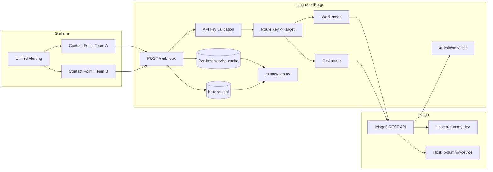
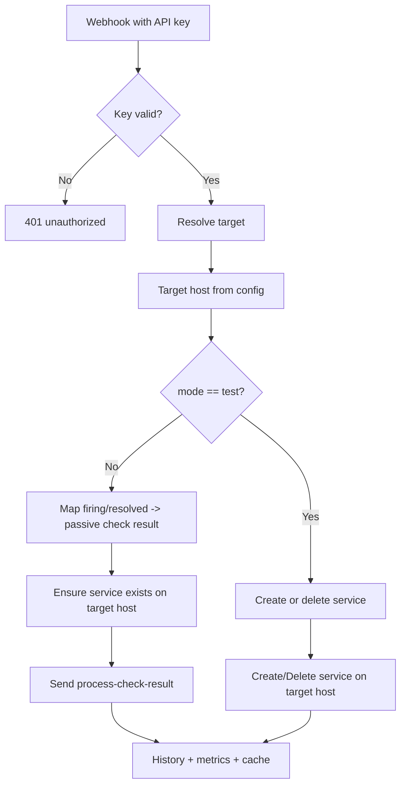

# Architecture and Setup

Back to the [Documentation Index](../README.md)

## Overview

IcingaAlertForge sits between Grafana and Icinga2.

Grafana is still the place where alerts are easy to create and change. Icinga stays focused on the alerts that are important enough to deserve a place in a stricter monitoring system. The bridge receives webhooks from Grafana, decides which Icinga dummy host should receive them, makes sure the required host or service exists, and then sends passive check results to Icinga2.

This direction matters:

```text
Grafana -> Icinga2
```

The bridge does not try to make Icinga the source of truth for those alerts. Grafana remains the source. Icinga is the destination used for presentation, state tracking, and notification handling.

## Architecture





## What The Service Contains

- one Icinga2 API client
- routing for several configured hosts
- one or more API keys for each host
- a cache keyed by `host + service`
- a JSONL history log
- a public and admin status panel
- admin endpoints for listing and deleting managed services

## Features

- routing for several teams and dummy hosts
- more than one API key for the same host or team
<!-- LANG: hyphenation -->
- host-specific notification settings
- dynamic dummy host creation on startup
- dynamic service creation in work mode
- test mode for manual create and delete actions
- JSONL history with filters
- a service cache with TTL and cleanup
- an admin API and a live panel
<!-- CHANGED: added SSE broker, debug ring buffer, and metrics features -->
- SSE broker for real-time event streaming to the dashboard
- debug ring buffer for API traffic inspection
- metrics collector with brute force detection
<!-- LANG: hyphenation -->
- a ready-to-use lab in `testenv`

## Requirements

- Go 1.24+
- Icinga2 with the REST API enabled on port `5665`
- Grafana Unified Alerting
- Docker and Compose if you want to use the bundled test environment

## Icinga2 API Permissions

The API user must be allowed to do the following:

```conf
permissions = [
  "actions/process-check-result",
  "objects/query/Service",
  "objects/create/Service",
  "objects/delete/Service",
  "objects/query/Host",
  "objects/create/Host"
]
```

If host auto creation is enabled, `objects/query/Host` and `objects/create/Host` are required as well.

## Installation

### From Source

```bash
git clone https://github.com/dzaczek/IcingaAlertForge.git
cd IcingaAlertForge

cp .env.example .env
# edit .env

go build -o webhook-bridge .
./webhook-bridge
```

### Docker

```bash
docker build -t webhook-bridge .

docker run -d \
  --name webhook-bridge \
  -p 8080:8080 \
  --env-file .env \
  -v webhook-logs:/var/log/webhook-bridge \
  webhook-bridge
```

### Docker Compose

```bash
docker compose up -d --build
```

If your Docker installation still uses the older `docker-compose` binary, that works too.

## Next Step

Continue with [Configuration](configuration.md).
