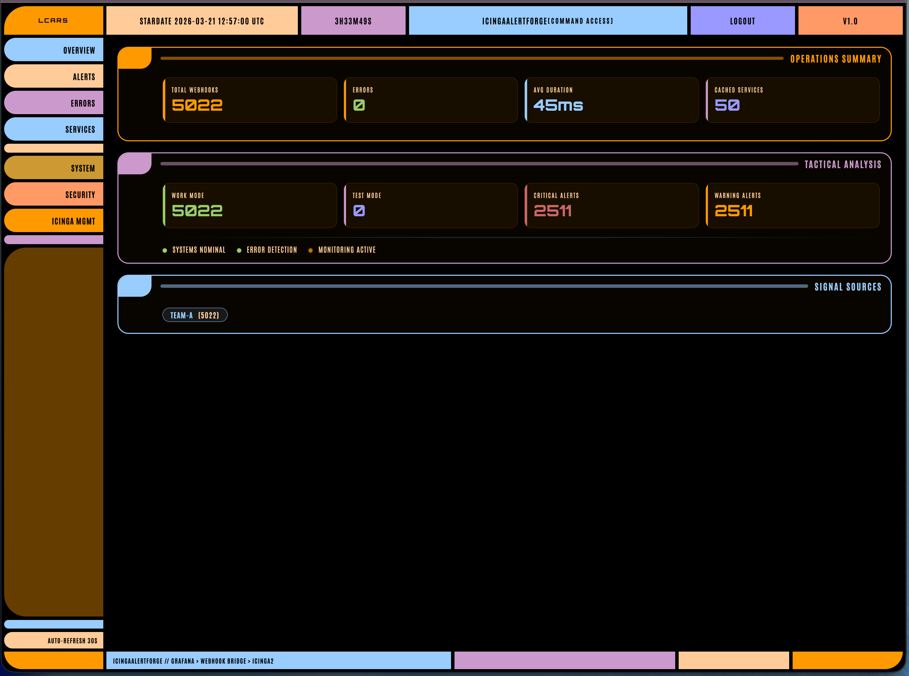
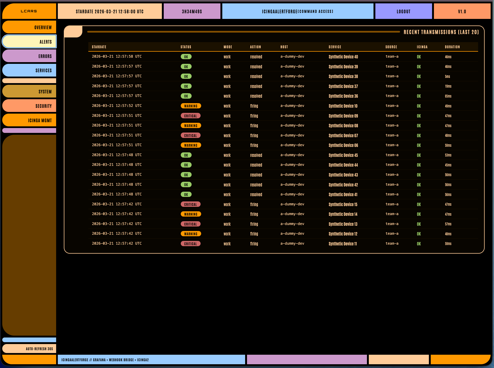
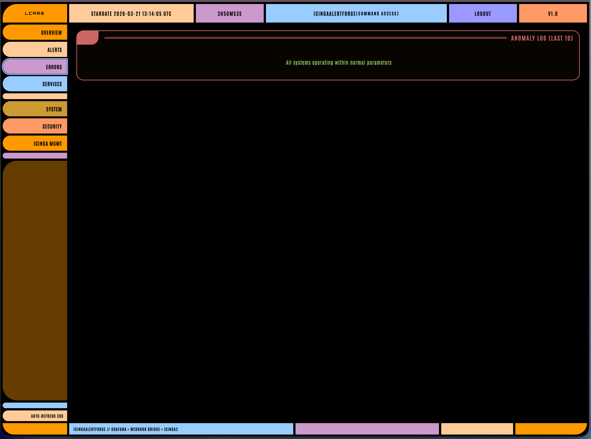
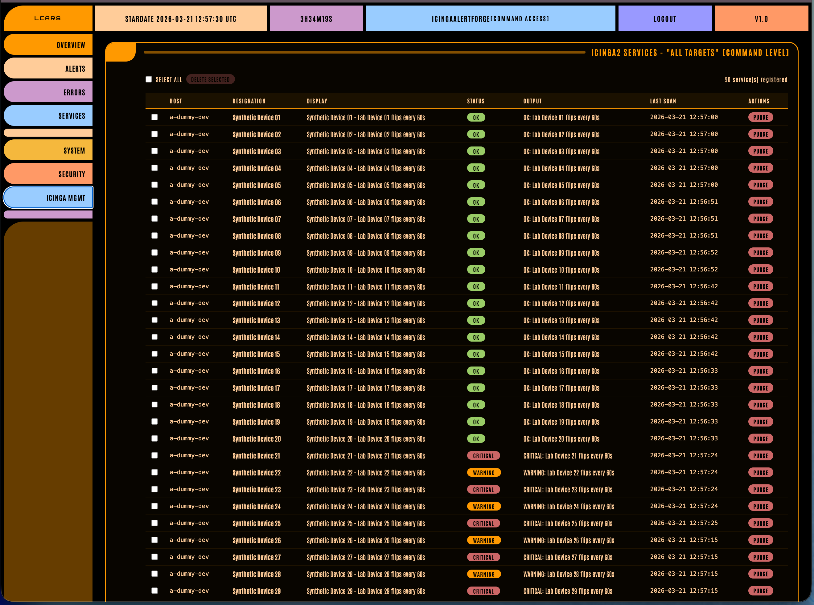
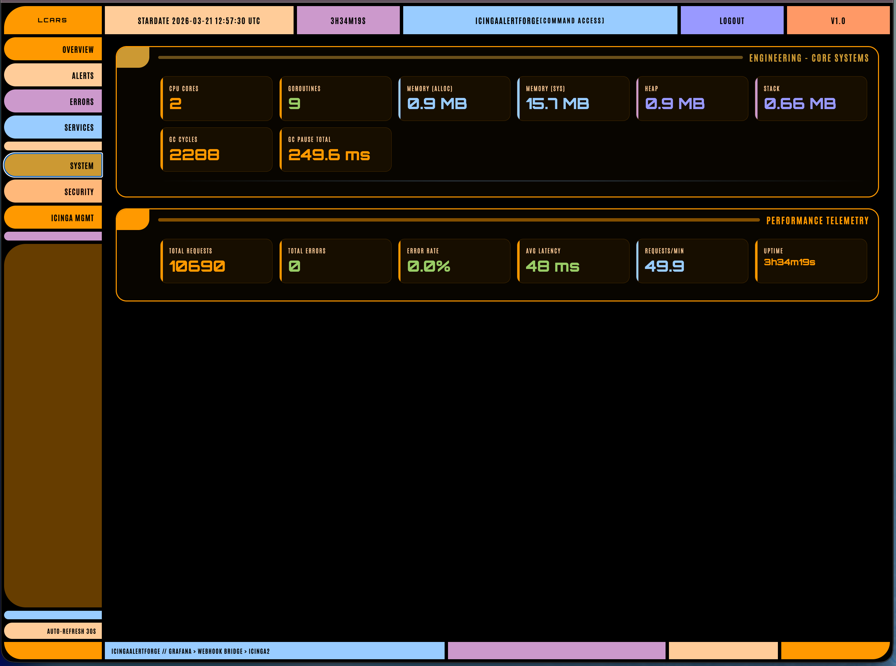

# Beauty Panel

Back to the [Documentation Index](../README.md)

## Where It Lives

- public view: `/status/beauty`
- admin view: `/status/beauty?admin=1`

<!-- LANG: hyphenation -->
The panel is an LCARS-style HTML dashboard. It is not meant to look like a generic admin table.

## Public View

The public panel shows:

- **Overview** — total webhook count, error count, average duration, cached service count, mode and severity breakdowns
- **System** — CPU cores, goroutines, memory usage, GC stats, uptime

Signal Sources, Alerts, Errors, and Services are not visible in the public view.

Example public views:

Overview:

Recent alerts:

Errors:

## Admin View

Admin mode adds everything from the public view, plus:

- **Signal Sources** in Overview (source counters with IP details)
- **Performance Telemetry** in System (total requests, errors, error rate, latency, requests/min)
- **Alerts** — recent transmissions table
- **Errors** — recent error details
- **Services** — cached service tags with status, single and bulk delete
- **Security** — failed auth counter, brute-force IP detection, recent auth failure log
- **Icinga Mgmt** — live Icinga2 service table across all configured hosts
- **Settings** — dashboard-based configuration management (when `CONFIG_IN_DASHBOARD=true`)
- **Dev Panel** — live API traffic inspector
- service history popup on service tags

Example admin views:

Service management:

System metrics:

Admin mode uses the same HTTP Basic Auth credentials as the admin API.

### Settings Panel

When `CONFIG_IN_DASHBOARD=true`, the Settings section provides full configuration management:

- **Icinga2 Connection** — host URL, user, password, TLS settings, test connection button
- **Targets & Webhooks** — add/delete targets via LCARS-style popup, reveal/hide API keys, generate new keys, copy keys to clipboard
- **Admin Credentials** — change admin user and password
- **History & Cache** — file path, max entries, cache TTL
- **Logging** — level and format
- **Rate Limiting** — mutate, status, and queue limits
- **Export/Import Backup** — full config backup as JSON (includes real secrets), restore from backup file

On first start with `CONFIG_IN_DASHBOARD=true`, the bridge migrates environment variables into a JSON config file stored on the Docker volume. Subsequent starts load from the JSON file. Secrets are encrypted at rest with AES-256-GCM using an auto-generated key.

### Security Panel

The Security section shows:

- **Failed Auth (Total)** — cumulative count of all failed authentication attempts
- **Brute Force IPs** — IPs with 3+ failed attempts in the last hour, shown in an "Intruder Alert" table
- **Recent Auth Failures** — last 20 failures with timestamp, IP address, and hashed key prefix

Auth failures are tracked from: webhook API key validation, admin panel login, settings API login, and dashboard admin login.

### Dev Panel

The Dev Panel is an admin-only section for inspecting live API traffic between Grafana and Icinga2. Navigate to it using `#devpanel` or the sidebar button.

Controls:

- **Debug ON/OFF** — toggles debug capture on the backend via `POST /admin/debug/toggle`
- **Pause/Resume** — pauses or resumes the SSE stream display (client-side only, backend keeps capturing)
- **Clear** — clears displayed entries from the panel

Each entry shows:

- **Direction** — `IN` (Grafana to IcingaAlertForge) or `OUT` (IcingaAlertForge to Icinga2)
- **Method and URL**
- **Status code and duration**
- **Timestamps**
- **Request/response bodies** with JSON syntax highlighting and a copy button

### Service History Popup

Click any service tag in the Services section to see its last 5 status changes. The popup fetches data from `/history?service=NAME&limit=5` and shows:

- Timestamp
- Action (`firing`, `resolved`, `create`)
- Exit status code
- Message

### SSE Real-time Updates

The dashboard uses Server-Sent Events (`/status/beauty/events`) for live updates. Webhook flow animations and debug stream entries arrive in real-time without polling.

### Info Popups

The `?` icons on panel section headers display LCARS-themed information popups explaining each section.

## Multi Host Behaviour

<!-- LANG: hyphenation -->
The panel reflects the current multi-host setup:

- services are shown across all managed hosts
- the service table includes `host`
- cache chips show `host / service`
- history rows include the host name

## Navigation

The panel uses URL hashes such as:

- `#overview`
- `#system`
- `#alerts` (admin)
- `#errors` (admin)
- `#services` (admin)
- `#security` (admin)
- `#icinga` (admin)
- `#settings` (admin)
- `#devpanel` (admin)

The navigation code was simplified to stop the old problem where the panel jumped between sections during refreshes.

## Screenshots

You do not need screenshots from a user machine to document the panel. The test environment already produces repeatable data, so screenshots can be taken directly from the local lab.

If you want screenshots that match the current UI:

1. start `testenv`
2. wait until Grafana and the bridge are healthy
3. open the public and admin panel views
4. wait for the synthetic alerts to populate recent activity and cache tables
5. capture the browser window

For the full workflow, see [Test Environment](test-environment.md).

---
**Next step →** [Test Environment](test-environment.md)
