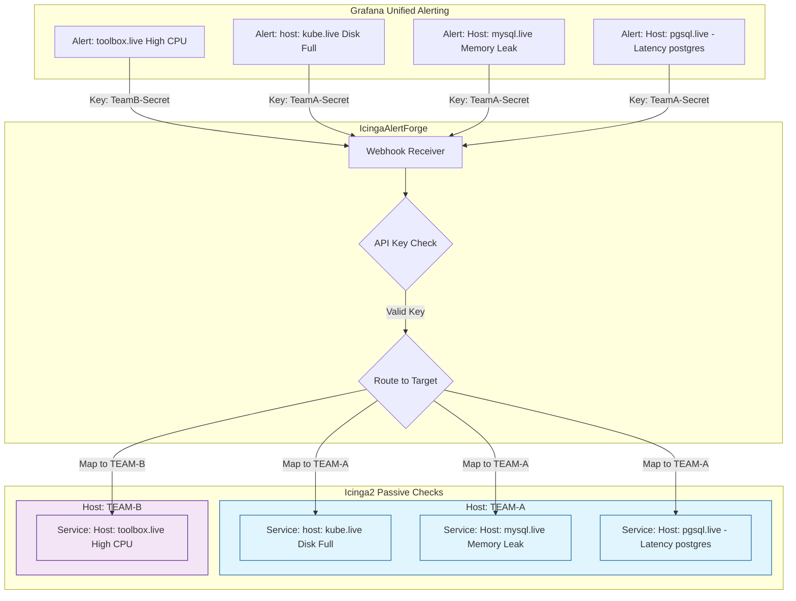

# Alert Routing Diagram

This diagram shows how IcingaAlertForge routes alerts from Grafana Unified Alerting to the correct Icinga2 hosts based on API key authentication.

```mermaid
graph TD
    subgraph Grafana_Alerting [Grafana Unified Alerting]
        A1[Alert: toolbox.live High CPU]
        A2[Alert: host: kube.live Disk Full]
        A3[Alert: Host: mysql.live Memory Leak]
        A4[Alert: Host: pgsql.live - Latency postgres]
    end

    subgraph Webhook_Bridge [IcingaAlertForge]
        direction TB
        W[Webhook Receiver]
        Auth{API Key Check}
        Route{Route to Target}

        W --> Auth
        Auth -->|Valid Key| Route
    end

    subgraph Icinga2_Monitoring [Icinga2 Passive Checks]
        subgraph Team_A_Host [Host: TEAM-A]
            S1[Service: host: kube.live Disk Full]
            S2[Service: Host: mysql.live Memory Leak]
            S0[Service: Host: pgsql.live - Latency postgres]
        end

        subgraph Team_B_Host [Host: TEAM-B]
            S3[Service: Host: toolbox.live High CPU]
        end
    end

    %% Alert flow
    A1 -->|Key: TeamB-Secret| W
    A2 -->|Key: TeamA-Secret| W
    A3 -->|Key: TeamA-Secret| W
    A4 -->|Key: TeamA-Secret| W

    Route -->|Map to TEAM-A| S0
    Route -->|Map to TEAM-A| S1
    Route -->|Map to TEAM-A| S2
    Route -->|Map to TEAM-B| S3

    classDef teamA fill:#e1f5fe,stroke:#01579b
    classDef teamB fill:#f3e5f5,stroke:#4a148c
    class Team_A_Host,S1,S2,S0 teamA
    class Team_B_Host,S3 teamB
```
