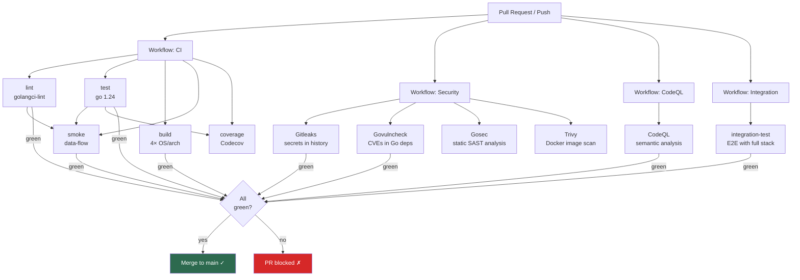
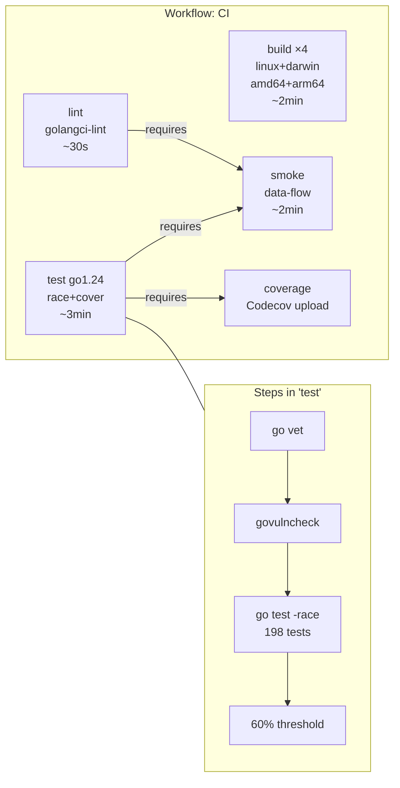
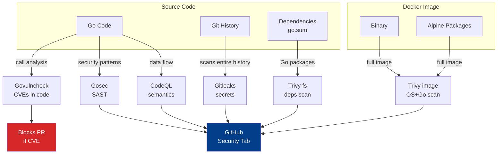
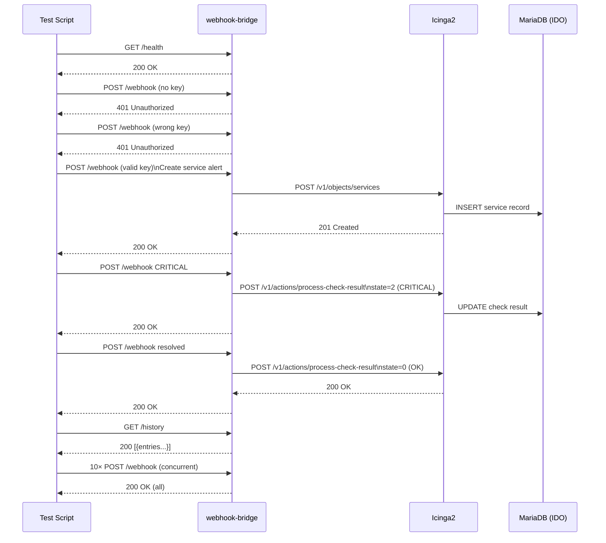
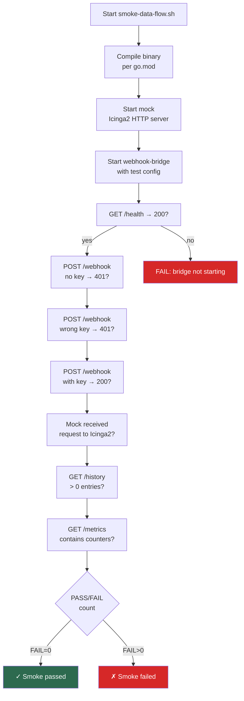
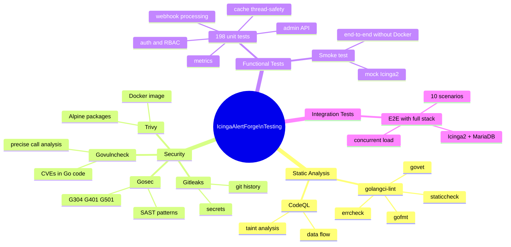

# Testing Pipeline — IcingaAlertForge

Document describing all testing layers run on every PR and push to `main`. Includes the name of each test/stage, explanation of what it checks and why, and flow diagrams.

---

## Table of Contents

1. [Overview](#1-overview)
2. [CI — Linting](#2-ci--linting)
3. [CI — Unit Tests](#3-ci--unit-tests)
4. [CI — Cross-platform Build](#4-ci--cross-platform-build)
5. [CI — Smoke Test](#5-ci--smoke-test)
6. [CI — Coverage](#6-ci--coverage)
7. [Security — Gitleaks](#7-security--gitleaks)
8. [Security — Govulncheck](#8-security--govulncheck)
9. [Security — Gosec](#9-security--gosec)
10. [Security — Trivy (Docker image)](#10-security--trivy-docker-image)
11. [CodeQL — Semantic Analysis](#11-codeql--semantic-analysis)
12. [Integration — E2E](#12-integration--e2e)
13. [Flow Diagrams](#13-flow-diagrams)

---

## 1. Overview

Every PR goes through **four independent GitHub Actions workflows**:

| Workflow | File | When |
|----------|------|-------|
| CI | `ci.yml` | PR → main, push → main |
| Security | `security.yml` | PR → main, push → main, every Monday |
| CodeQL | `codeql.yml` | PR → main, push → main, every Wednesday |
| Integration | `integration.yml` | PR → main, nightly (02:37 UTC) |

All four must be green for a PR to be merged.

---

## 2. CI — Linting

**Job:** `lint`  
**Tool:** `golangci-lint v9 (latest)`  
**Timeout:** 10 minutes

### What it checks and why

| Rule | What it detects | Why it matters |
|------|----------------|----------------|
| `gofmt` | Inconsistent code formatting | Go has one canonical style — deviations make code review harder |
| `govet` | Semantic errors (e.g., incorrect printf formats) | Catches errors the compiler misses |
| `errcheck` | Unhandled errors from functions returning `error` | Missed error = silent failure in production |
| `staticcheck` | Dead code, inefficient patterns, deprecated APIs | Code quality and maintainability |
| `gosimple` | Unnecessarily complex constructs | Readability |
| `unused` | Unused symbols (functions, variables, fields) | Indicates poorly thought-out architecture |

**Why this stage is first:** Linting is the fastest (~30s). If someone forgot to run `gofmt`, we don't waste 3 minutes on compilation and tests.

---

## 3. CI — Unit Tests

**Job:** `test (go 1.24)`  
**Flags:** `-race -count=1 -timeout=120s -coverprofile`  
**Coverage threshold:** 60%  
**Number of tests:** ~198 test functions

### 3.1 go vet

Static code analysis by the Go compiler. Detects:
- Errors in `//go:build` directives
- Incorrect `sync.Mutex` usage (copy by value)
- Unreachable code after `return`

**Why before tests:** `go vet` is free (built-in) and catches errors tests might miss.

### 3.2 govulncheck (within CI)

Checks whether used dependencies have known CVEs in the `vuln.go.dev` database. Unlike Trivy (which scans binaries), govulncheck analyzes **which functions from vulnerable packages are actually called** — eliminating false positives.

### 3.3 Unit tests with race detector

The `-race` flag enables the Go Race Detector — it instruments code to detect data races at runtime. Data races are among the hardest bugs to debug in concurrent systems.

#### Tests grouped by layer

**Layer: Authentication & Authorization (`auth/`, `rbac/`)**

| Test | What it checks |
|------|----------------|
| `TestAuthenticate` | Valid and invalid API keys return correct results |
| `TestAuthorize` | Role-Based Access Control — whether a given key has access to a given action |
| `TestAddRemoveUser` | Dynamic user add/remove without restart |

**Layer: Webhook Handler (`handler/webhook_test.go`)**

| Test | What it checks |
|------|----------------|
| `TestWebhookHandler` | Processing Grafana/Alertmanager payloads |
| `TestAlertmanagerToGrafana` | Alertmanager to internal format conversion |
| `TestCreateHost_Success/Error` | Creating a host in Icinga2 — happy path and HTTP error |
| `TestCreateService_Success/Error` | Creating a service — success and error handling |
| `TestDeleteService_Success/Error` | Deleting a service from Icinga2 |

**Layer: Admin API (`handler/admin_test.go` + gap/extra)**

| Test | What it checks |
|------|----------------|
| `TestAdmin_Auth` | `/admin/*` endpoint requires authentication |
| `TestAdmin_HandleCreateUser` | Creating a user via API |
| `TestAdmin_HandleDeleteUser` | Deleting a user |
| `TestAdmin_HandleFreezeService` | Freezing a service (blocks alerts) |
| `TestAdmin_HandleListFrozen` | List of frozen services |
| `TestAdmin_HandleSetServiceStatus` | Setting service status |
| `TestAdmin_HandleBulkDelete` | Bulk service deletion |
| `TestAdmin_HandleClearHistory` | Clearing alert history |
| `TestAdmin_HandleQueueStats` | Retry queue statistics |
| `TestAdmin_HandleRateLimitStats` | Rate limiter statistics |
| `TestAdmin_HandleDebugToggle` | Toggle debug mode on/off |

**Layer: Cache (`cache/`)**

| Test | What it checks |
|------|----------------|
| `TestConcurrency` | Cache is thread-safe under high load (race test) |
| `TestAllFrozen` | Service freeze logic |
| `TestFreeze_PermanentAndUnfreeze` | Permanent freeze and unfreeze |
| `TestFreeze_WithExpiry` | Freeze with expiration date |
| `TestFreeze_ExpiredTreatedAsUnfrozen` | After expiry, service is treated as active |
| `TestExists` | Checking service presence in cache |
| `TestConflictDetection` | Detecting conflicts during concurrent operations |

**Layer: Config (`config/`, `configstore/`)**

| Test | What it checks |
|------|----------------|
| `TestBuildSourceIPLists` | Parsing IP lists from configuration |
| `TestEnqueue`, `TestEnqueueOverflow` | Queueing and queue overflow |
| `TestBackoff` | Exponential backoff on retry |
| `TestFlush` | Queue flush |

**Layer: Metrics (`metrics/`)**

| Test | What it checks |
|------|----------------|
| `TestCollector_RequestMetrics` | HTTP metrics (latency, status codes) |
| `TestCollector_AuthFailures` | Failed authentication counter |
| `TestCollector_SystemStats` | System metrics (goroutines, memory) |
| `TestCollector_KeyPrefixTruncation` | Truncation of long API key names |

**Layer: HTTP Utils (`httputil/`)**

| Test | What it checks |
|------|----------------|
| `TestExitStatusLabel` | Mapping Icinga exit codes to labels |
| `TestFirstHostName` | Extracting the first hostname from a list |
| `TestExport` | Exporting history to JSONL |

### 3.4 Coverage threshold (60%)

After tests, a script verifies that total code coverage is ≥ 60%. This value is a minimum — it guarantees that critical paths (authentication, alert processing) are tested, without the false sense of security that 100% trivial tests would give.

---

## 4. CI — Cross-platform Build

**Job:** `build (linux/amd64, linux/arm64, darwin/amd64, darwin/arm64)`  
**CGO:** disabled (static binaries)

### What it checks and why

Compilation on 4 OS/arch combinations guarantees that:
1. The code doesn't use platform-specific constructs
2. The binary is statically linked — works without any system dependencies
3. The embedded version (`-X main.version`) is correctly injected

**Trivy (filesystem scan)** — runs after compilation, scans Go dependencies (`go.sum`) for CVEs. Soft fail (`exit-code: 0`) — results go to the Security tab but don't block the PR.

---

## 5. CI — Smoke Test

**Job:** `smoke`  
**Script:** `scripts/smoke-data-flow.sh`  
**Depends on:** `lint`, `test`

### What it checks and why

The smoke test runs the **real bridge process** with a mock Icinga2 server. It's the fastest end-to-end test — no Docker or external services required.

#### Smoke test stages

| Stage | What it verifies |
|------|-----------------|
| Start bridge | Binary starts without config errors |
| `GET /health` → 200 | Health check endpoint responds correctly |
| `GET /status` → 200 | Status endpoint returns data |
| `POST /webhook` without key → 401 | Unauthenticated requests are rejected |
| `POST /webhook` with key → 200 | Authenticated payload is accepted |
| Mock Icinga2 receives request | Alert reaches Icinga2 (end-to-end flow) |
| History contains entry | Alert is written to history log |
| `GET /history` returns entries | History is available via API |
| Prometheus metrics | `/metrics` contains expected counters |

**Why smoke ≠ unit test:** Unit tests mock external layers. The smoke test runs all layers together, catching integration bugs (e.g., incorrect HTTP routing, improper dependency initialization).

---

## 6. CI — Coverage

**Job:** `coverage`  
**Tool:** Codecov  
**Depends on:** `test`

Uploads the coverage report to Codecov, where it is visualized per-file and per-function. Enables tracking coverage trends over time and identifying new untested code.

---

## 7. Security — Gitleaks

**Job:** `Gitleaks`  
**Timeout:** 5 minutes  
**Scans:** entire git history (`fetch-depth: 0`)

### What it checks and why

Gitleaks scans **every commit in history** for accidentally committed secrets:
- API keys (AWS, GCP, Stripe, GitHub tokens)
- Passwords in configuration files
- Certificates and private keys
- Connection strings with passwords

**Why the entire history:** A secret committed and immediately removed in the next commit is still visible in git history. The scanner must inspect everything.

---

## 8. Security — Govulncheck

**Job:** `Go Vulncheck`  
**Timeout:** 10 minutes

### What it checks and why

Govulncheck analyzes **function calls** in compiled code. It differs from Trivy in that:

- **Trivy:** "this package has a CVE" → may be a false positive if the vulnerable function isn't called
- **Govulncheck:** "this specific vulnerable function IS called from your code" → zero false positives

Example: if `golang.org/x/net` has a CVE in `http2.Server.ServeConn`, but the bridge only uses an HTTP client (not a server), govulncheck won't raise an alert.

---

## 9. Security — Gosec

**Job:** `Gosec`  
**Results:** SARIF → GitHub Security tab (soft fail)

### What it checks and why

Gosec is a static security analyzer for Go. It checks code patterns for common vulnerabilities:

| Rule | Detected threat |
|------|-----------------|
| G101 | Hardcoded passwords/secrets |
| G103 | Use of `unsafe` |
| G201/202 | SQL injection |
| G304 | Path traversal (`os.Open(userInput)`) |
| G401/402 | Weak cryptographic algorithms (MD5, SHA1) |
| G501/502 | Deprecated crypto functions |
| G601 | Iterating over slice elements using a pointer |

**Why soft fail:** Gosec generates false positives for known safe patterns (e.g., `os.Open` on a server config path, not from user input). Results go to the Security tab for manual evaluation. Critical findings (like G304 in this project) are addressed by creating dedicated issues.

---

## 10. Security — Trivy (Docker image)

**Job:** `Trivy`  
**Scans:** built Docker image `icingaalertforge:ci-scan`

### What it checks and why

Trivy scans the **finished Docker image** — not just Go dependencies, but also:
- Alpine base image (system packages)
- C libraries in the container
- Configuration files

It works independently of govulncheck — together they provide full coverage: govulncheck (Go layer) + Trivy (OS layer).

**Severity HIGH/CRITICAL** — lower priorities are ignored to avoid alert fatigue.

---

## 11. CodeQL — Semantic Analysis

**Job:** `Analyze (Go)`  
**Timeout:** 30 minutes  
**Schedule:** PR + every Wednesday

### What it checks and why

CodeQL is a GitHub tool for **semantic code analysis**. It compiles the code and builds a data flow model, detecting:

| Category | Examples |
|----------|----------|
| Injection | SQL injection, command injection |
| Path traversal | Unvalidated file paths |
| Insecure randomness | `math/rand` instead of `crypto/rand` for secrets |
| Incorrect error handling | Ignoring security errors |
| Taint analysis | User data reaching unsafe functions |

**Why every Wednesday:** New CodeQL rules are regularly added. The weekly schedule allows detecting new vulnerabilities in already committed code, even without new changes.

---

## 12. Integration — E2E

**Job:** `integration-test`  
**Timeout:** 20 minutes  
**Schedule:** PR + nightly (02:37 UTC)

### Test environment

Docker Compose launches the full stack:

```
Icinga2 → MariaDB (IDO)
       ↑
webhook-bridge (under test)
       ↑
testenv scripts (tests)

Prometheus ← bridge metrics
Grafana → dashboards
```

### E2E tests

| # | Name | What it checks | Why |
|---|------|----------------|-----|
| 0 | Health check | `GET /health` → HTTP 200 | Bridge is ready to accept requests |
| 1 | No API key → 401 | `POST /webhook` without `X-API-Key` header returns 401 | Authentication works — unauthenticated requests are rejected |
| 2 | Wrong API key → 401 | `POST /webhook` with wrong key returns 401 | Key verification is correct — any key won't work |
| 3 | Create dummy service | Webhook creates a service in Icinga2 | Full alert→Icinga flow works |
| 4 | Alert CRITICAL | CRITICAL status is correctly forwarded | Severity mapping works |
| 5 | Alert WARNING | WARNING status is correctly forwarded | All severity levels are handled |
| 6 | Resolved → OK | "resolved" alert changes status to OK in Icinga2 | Alert closure works (not just opening) |
| 7 | History has entries | `GET /history` returns > 0 entries | Alert history is saved and available via API |
| 8 | Delete service | Service is removed from Icinga2 after tests finish | Resource cleanup works — important for idempotency |
| 9 | Beauty dashboard | `GET /status/beauty` → HTTP 200 | Status UI works |
| 10 | 10 concurrent alerts | 10 concurrent requests without errors | Bridge is thread-safe under load |

**Why nightly run:** Integration tests take ~5 min and require Docker. Running them nightly (not just on PR) catches regressions caused by external dependency changes (new Icinga2, MariaDB versions).

---

## 13. Flow Diagrams

### 13.1 Overall CI/CD Pipeline



### 13.2 CI Pipeline — Job Details



### 13.3 Security Layers



### 13.4 Integration E2E — Data Flow



### 13.5 Smoke Test — Local Verification Without Docker



---

## Testing Layers Summary



---

*Document generated based on repository state. Update when adding new workflows or testing layers.*
