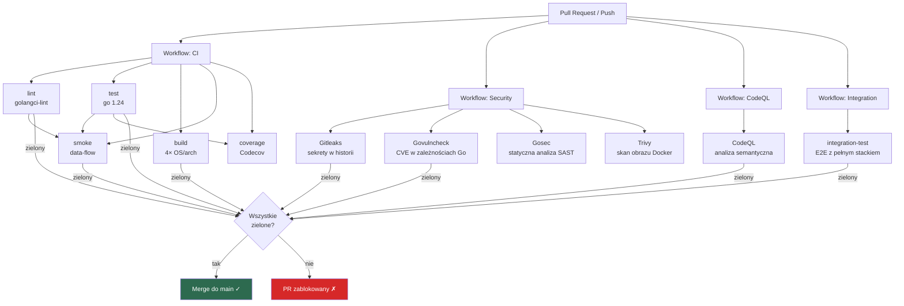
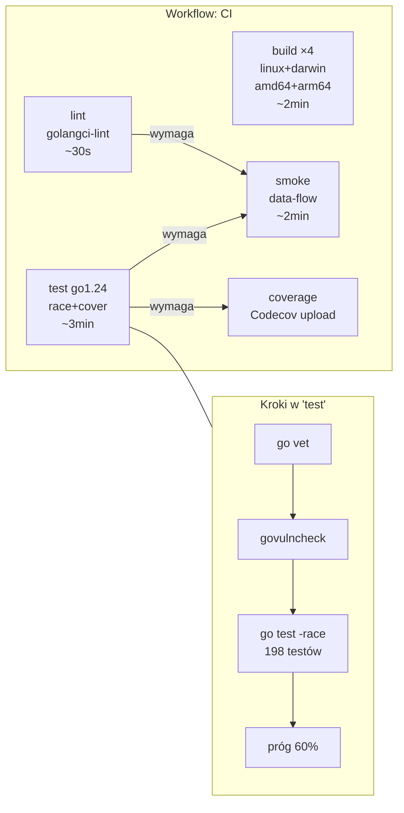
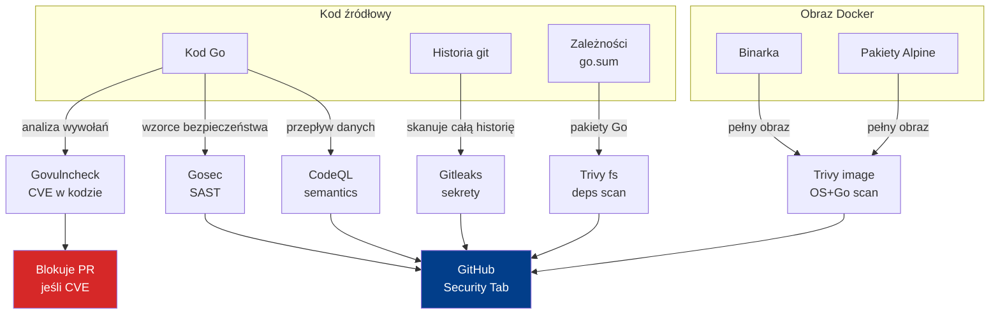
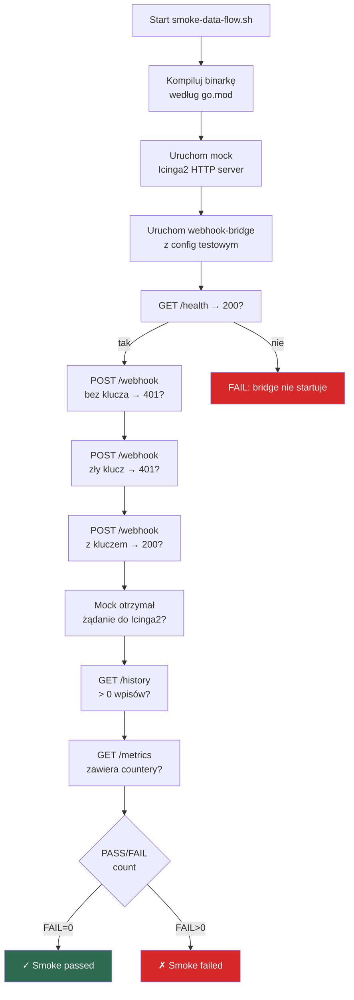
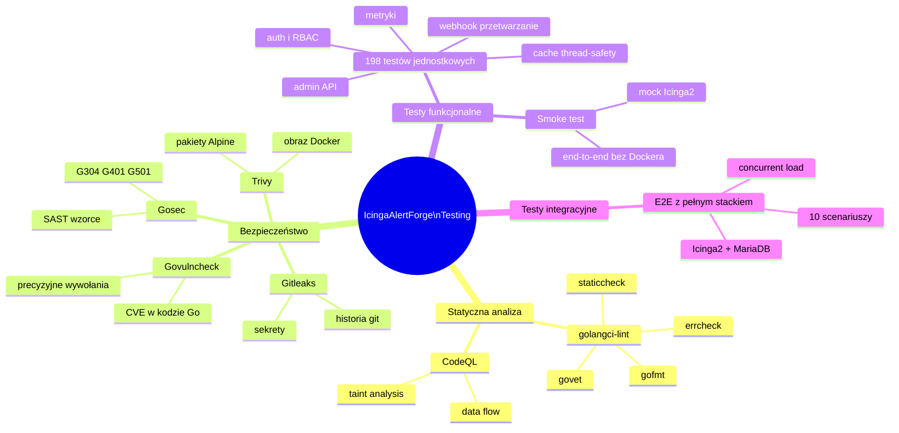

# Testing Pipeline — IcingaAlertForge

Dokument opisuje wszystkie warstwy testowania uruchamiane przy każdym PR i pushu na `main`. Zawiera nazwę każdego testu/etapu, wyjaśnienie co sprawdza i dlaczego, oraz diagramy przepływu.

---

## Spis treści

1. [Przegląd ogólny](#1-przegląd-ogólny)
2. [CI — Linting](#2-ci--linting)
3. [CI — Testy jednostkowe](#3-ci--testy-jednostkowe)
4. [CI — Build cross-platform](#4-ci--build-cross-platform)
5. [CI — Smoke test](#5-ci--smoke-test)
6. [CI — Coverage](#6-ci--coverage)
7. [Security — Gitleaks](#7-security--gitleaks)
8. [Security — Govulncheck](#8-security--govulncheck)
9. [Security — Gosec](#9-security--gosec)
10. [Security — Trivy (Docker image)](#10-security--trivy-docker-image)
11. [CodeQL — Analiza semantyczna](#11-codeql--analiza-semantyczna)
12. [Integration — E2E](#12-integration--e2e)
13. [Diagramy przepływu](#13-diagramy-przepływu)

---

## 1. Przegląd ogólny

Każdy PR przechodzi przez **cztery niezależne workflow** GitHub Actions:

| Workflow | Plik | Kiedy |
|----------|------|-------|
| CI | `ci.yml` | PR → main, push → main |
| Security | `security.yml` | PR → main, push → main, co poniedziałek |
| CodeQL | `codeql.yml` | PR → main, push → main, co środę |
| Integration | `integration.yml` | PR → main, co noc (02:37 UTC) |

Wszystkie cztery muszą być zielone, żeby PR mógł być zmergowany.

---

## 2. CI — Linting

**Job:** `lint`  
**Narzędzie:** `golangci-lint v9 (latest)`  
**Timeout:** 10 minut

### Co sprawdza i dlaczego

| Reguła | Co wykrywa | Dlaczego ważne |
|--------|-----------|----------------|
| `gofmt` | Niespójne formatowanie kodu | Go ma jeden kanoniczny styl — odchylenia utrudniają code review |
| `govet` | Błędy semantyczne (np. nieprawidłowe formaty printf) | Lapie błędy które kompilator pomija |
| `errcheck` | Niezobsługiwane błędy z funkcji zwracających `error` | Pominięty błąd = cicha awaria w produkcji |
| `staticcheck` | Martwy kod, niewydajne wzorce, przestarzałe API | Jakość i utrzymywalność kodu |
| `gosimple` | Zbędnie skomplikowane konstrukcje | Czytelność |
| `unused` | Nieużywane symbole (funkcje, zmienne, pola) | Świadczy o nieprzemyślanej architekturze |

**Dlaczego ten etap jest pierwszy:** Lint jest najszybszy (ok. 30s). Jeśli ktoś zapomniał uruchomić `gofmt`, nie marnujemy 3 minut na kompilację i testy.

---

## 3. CI — Testy jednostkowe

**Job:** `test (go 1.24)`  
**Flagi:** `-race -count=1 -timeout=120s -coverprofile`  
**Próg pokrycia:** 60%  
**Liczba testów:** ~198 funkcji testowych

### 3.1 go vet

Statyczna analiza kodu przez kompilator Go. Wykrywa:
- Błędy w dyrektywach `//go:build`
- Nieprawidłowe wywołania `sync.Mutex` (kopiowanie przez wartość)
- Nieosiągalny kod po `return`

**Dlaczego przed testami:** `go vet` jest bezpłatny (wbudowany) i lapie błędy które testy mogą pominąć.

### 3.2 govulncheck (w ramach CI)

Sprawdza czy używane zależności mają znane CVE w bazie danych `vuln.go.dev`. W przeciwieństwie do Trivy (który skanuje binarka), govulncheck analizuje **które funkcje z podatnych pakietów są faktycznie wywoływane** — eliminuje fałszywe alarmy.

### 3.3 Testy jednostkowe z race detektorem

Flaga `-race` uruchamia Go Race Detector — instrumentuje kod tak, żeby wykrywał wyścigi danych (data races) w czasie wykonania. Wyścig danych jest jednym z najtrudniejszych do debugowania błędów w systemach wielowątkowych.

#### Pogrupowane testy według warstwy

**Warstwa: Authentication & Authorization (`auth/`, `rbac/`)**

| Test | Co sprawdza |
|------|-------------|
| `TestAuthenticate` | Poprawne i niepoprawne klucze API zwracają właściwe rezultaty |
| `TestAuthorize` | Role-Based Access Control — czy dany klucz ma dostęp do danej akcji |
| `TestAddRemoveUser` | Dynamiczne dodawanie/usuwanie użytkowników bez restartu |

**Warstwa: Webhook Handler (`handler/webhook_test.go`)**

| Test | Co sprawdza |
|------|-------------|
| `TestWebhookHandler` | Przetwarzanie payloadów Grafana/Alertmanager |
| `TestAlertmanagerToGrafana` | Konwersja formatu Alertmanager → wewnętrzny format |
| `TestCreateHost_Success/Error` | Tworzenie hosta w Icinga2 — happy path i błąd HTTP |
| `TestCreateService_Success/Error` | Tworzenie usługi — sukces i obsługa błędów |
| `TestDeleteService_Success/Error` | Usuwanie usługi z Icinga2 |

**Warstwa: Admin API (`handler/admin_test.go` + gap/extra)**

| Test | Co sprawdza |
|------|-------------|
| `TestAdmin_Auth` | Endpoint `/admin/*` wymaga uwierzytelnienia |
| `TestAdmin_HandleCreateUser` | Tworzenie użytkownika przez API |
| `TestAdmin_HandleDeleteUser` | Usuwanie użytkownika |
| `TestAdmin_HandleFreezeService` | Zamrożenie serwisu (blokuje alerty) |
| `TestAdmin_HandleListFrozen` | Lista zamrożonych serwisów |
| `TestAdmin_HandleSetServiceStatus` | Ustawianie statusu serwisu |
| `TestAdmin_HandleBulkDelete` | Masowe usuwanie serwisów |
| `TestAdmin_HandleClearHistory` | Czyszczenie historii alertów |
| `TestAdmin_HandleQueueStats` | Statystyki kolejki retry |
| `TestAdmin_HandleRateLimitStats` | Statystyki rate limitera |
| `TestAdmin_HandleDebugToggle` | Włączanie/wyłączanie trybu debug |

**Warstwa: Cache (`cache/`)**

| Test | Co sprawdza |
|------|-------------|
| `TestConcurrency` | Cache jest thread-safe pod dużym obciążeniem (race test) |
| `TestAllFrozen` | Logika zamrażania serwisów |
| `TestFreeze_PermanentAndUnfreeze` | Trwałe zamrożenie i odmrożenie |
| `TestFreeze_WithExpiry` | Zamrożenie z datą wygaśnięcia |
| `TestFreeze_ExpiredTreatedAsUnfrozen` | Po wygaśnięciu serwis traktowany jako aktywny |
| `TestExists` | Sprawdzenie obecności serwisu w cache |
| `TestConflictDetection` | Wykrywanie konfliktów przy równoczesnych operacjach |

**Warstwa: Config (`config/`, `configstore/`)**

| Test | Co sprawdza |
|------|-------------|
| `TestBuildSourceIPLists` | Parsowanie list IP z konfiguracji |
| `TestEnqueue`, `TestEnqueueOverflow` | Kolejkowanie i przepełnienie kolejki |
| `TestBackoff` | Wykładniczy backoff przy retry |
| `TestFlush` | Opróżnienie kolejki |

**Warstwa: Metrics (`metrics/`)**

| Test | Co sprawdza |
|------|-------------|
| `TestCollector_RequestMetrics` | Metryki HTTP (latency, status codes) |
| `TestCollector_AuthFailures` | Licznik nieudanych uwierzytelnień |
| `TestCollector_SystemStats` | Metryki systemowe (goroutines, pamięć) |
| `TestCollector_KeyPrefixTruncation` | Skracanie długich nazw kluczy API |

**Warstwa: HTTP Utils (`httputil/`)**

| Test | Co sprawdza |
|------|-------------|
| `TestExitStatusLabel` | Mapowanie kodów wyjścia Icinga na etykiety |
| `TestFirstHostName` | Ekstrakcja pierwszej nazwy hosta z listy |
| `TestExport` | Eksport historii do JSONL |

### 3.4 Próg pokrycia (60%)

Po testach skrypt sprawdza czy łączne pokrycie kodu wynosi ≥ 60%. Wartość ta jest minimalna — gwarantuje że krytyczne ścieżki (autentykacja, przetwarzanie alertów) są przetestowane, bez fałszywego poczucia bezpieczeństwa przy 100% trywialnych testów.

---

## 4. CI — Build cross-platform

**Job:** `build (linux/amd64, linux/arm64, darwin/amd64, darwin/arm64)`  
**CGO:** wyłączone (statyczne binarki)

### Co sprawdza i dlaczego

Kompilacja na 4 kombinacjach OS/arch gwarantuje że:
1. Kod nie używa konstrukcji specyficznych dla jednej platformy
2. Binarka jest statycznie linkowana — działa bez żadnych zależności systemowych
3. Wbudowana wersja (`-X main.version`) jest poprawnie iniekcjonowana

**Trivy (filesystem scan)** — uruchamiany po kompilacji, skanuje zależności Go (`go.sum`) pod kątem CVE. Miękki fail (`exit-code: 0`) — wyniki trafiają do Security tab, ale nie blokują PR.

---

## 5. CI — Smoke test

**Job:** `smoke`  
**Skrypt:** `scripts/smoke-data-flow.sh`  
**Zależy od:** `lint`, `test`

### Co sprawdza i dlaczego

Smoke test uruchamia **prawdziwy proces bridge** z mockowym serwerem Icinga2. Jest to najszybszy test end-to-end — nie wymaga Dockera ani zewnętrznych serwisów.

#### Etapy smoke testu

| Etap | Co weryfikuje |
|------|---------------|
| Uruchomienie bridge | Binary startuje bez błędów konfiguracyjnych |
| `GET /health` → 200 | Endpoint health check odpowiada poprawnie |
| `GET /status` → 200 | Status endpoint zwraca dane |
| `POST /webhook` bez klucza → 401 | Nieuwierzytelnione żądania są odrzucane |
| `POST /webhook` z kluczem → 200 | Uwierzytelniony payload jest akceptowany |
| Mock Icinga2 otrzymuje żądanie | Alert dociera do Icinga2 (end-to-end flow) |
| Historia zawiera wpis | Alert jest zapisywany w logu historii |
| `GET /history` zwraca wpisy | Historia jest dostępna przez API |
| Metryki Prometheus | `/metrics` zawiera oczekiwane counter-y |

**Dlaczego smoke ≠ unit test:** Testy jednostkowe mockują warstwy zewnętrzne. Smoke test uruchamia wszystkie warstwy razem, wykrywając błędy integracji (np. niewłaściwe routing HTTP, nieprawidłowe inicjalizowanie zależności).

---

## 6. CI — Coverage

**Job:** `coverage`  
**Narzędzie:** Codecov  
**Zależy od:** `test`

Przesyła raport pokrycia do Codecov, gdzie jest wizualizowany per-plik i per-funkcja. Umożliwia śledzenie trendów pokrycia w czasie i identyfikację nowych kodów bez testów.

---

## 7. Security — Gitleaks

**Job:** `Gitleaks`  
**Timeout:** 5 minut  
**Skanuje:** cała historia gita (`fetch-depth: 0`)

### Co sprawdza i dlaczego

Gitleaks skanuje **każdy commit w historii** pod kątem przypadkowo wkomitowanych sekretów:
- Kluczy API (AWS, GCP, Stripe, GitHub tokens)
- Haseł w plikach konfiguracyjnych
- Certyfikatów i kluczy prywatnych
- Connection strings z hasłami

**Dlaczego cała historia:** Sekret wkomitowany i natychmiast usunięty w następnym commicie nadal jest widoczny w historii gita. Skaner musi przejrzeć wszystko.

---

## 8. Security — Govulncheck

**Job:** `Go Vulncheck`  
**Timeout:** 10 minut

### Co sprawdza i dlaczego

Govulncheck analizuje **wywołania funkcji** w skompilowanym kodzie. Różni się od Trivy tym, że:

- **Trivy:** "ten pakiet ma CVE" → może być fałszywy alarm jeśli podatna funkcja nie jest wywoływana
- **Govulncheck:** "ta konkretna podatna funkcja Jest wywoływana z twojego kodu" → zero fałszywych alarmów

Przykład: jeśli `golang.org/x/net` ma CVE w funkcji `http2.Server.ServeConn`, ale bridge używa tylko klienta HTTP (nie serwera), govulncheck nie zgłosi alarmu.

---

## 9. Security — Gosec

**Job:** `Gosec`  
**Wyniki:** SARIF → GitHub Security tab (soft fail)

### Co sprawdza i dlaczego

Gosec to statyczny analizator bezpieczeństwa dla Go. Sprawdza wzorce kodu pod kątem popularnych podatności:

| Reguła | Wykrywane zagrożenie |
|--------|---------------------|
| G101 | Hardkodowane hasła/sekrety |
| G103 | Użycie `unsafe` |
| G201/202 | SQL injection |
| G304 | Path traversal (`os.Open(userInput)`) |
| G401/402 | Słabe algorytmy kryptograficzne (MD5, SHA1) |
| G501/502 | Przestarzałe funkcje crypto |
| G601 | Iteracja po elementach slice z użyciem wskaźnika |

**Dlaczego soft fail:** Gosec generuje false positives dla znanych bezpiecznych wzorców (np. `os.Open` na ścieżce z konfiguracji serwera, nie od użytkownika). Wyniki trafiają do Security tab gdzie są oceniane manualnie. Krytyczne znaleziska (jak G304 w tym projekcie) są naprawiane przez tworzenie dedykowanych issues.

---

## 10. Security — Trivy (Docker image)

**Job:** `Trivy`  
**Skanuje:** zbudowany obraz Docker `icingaalertforge:ci-scan`

### Co sprawdza i dlaczego

Trivy skanuje **gotowy obraz Docker** — nie tylko zależności Go, ale też:
- Bazowy obraz Alpine (pakiety systemowe)
- Biblioteki C w kontenerze
- Pliki konfiguracyjne

Działa niezależnie od govulncheck — razem tworzą pełne pokrycie: govulncheck (warstwa Go) + Trivy (warstwa OS).

**Severity HIGH/CRITICAL** — niższe priorytety są ignorowane żeby unikać alert fatigue.

---

## 11. CodeQL — Analiza semantyczna

**Job:** `Analyze (Go)`  
**Timeout:** 30 minut  
**Harmonogram:** PR + każda środa

### Co sprawdza i dlaczego

CodeQL to narzędzie GitHub do **semantycznej analizy kodu**. Kompiluje kod i buduje model przepływu danych, wykrywając:

| Kategoria | Przykłady |
|-----------|-----------|
| Injection | SQL injection, command injection |
| Path traversal | Niezwalidowane ścieżki do plików |
| Insecure randomness | `math/rand` zamiast `crypto/rand` dla sekretów |
| Nieprawidłowa obsługa błędów | Ignorowanie błędów bezpieczeństwa |
| Taint analysis | Dane od użytkownika docierające do niebezpiecznych funkcji |

**Dlaczego co środę:** Nowe reguły CodeQL są regularnie dodawane. Harmonogram tygodniowy pozwala wykrywać nowe podatności w już wkomitowanym kodzie, nawet bez nowych zmian.

---

## 12. Integration — E2E

**Job:** `integration-test`  
**Timeout:** 20 minut  
**Harmonogram:** PR + co noc (02:37 UTC)

### Środowisko testowe

Docker Compose uruchamia pełny stack:

```
Icinga2 → MariaDB (IDO)
       ↑
webhook-bridge (testowany)
       ↑
testenv scripts (testy)

Prometheus ← metryki bridge
Grafana → dashboardy
```

### Testy E2E

| # | Nazwa | Co sprawdza | Dlaczego |
|---|-------|-------------|----------|
| 0 | Health check | `GET /health` → HTTP 200 | Bridge jest gotowy do przyjmowania requestów |
| 1 | No API key → 401 | `POST /webhook` bez nagłówka `X-API-Key` zwraca 401 | Autentykacja działa — nieuwierzytelnione requesty są odrzucane |
| 2 | Wrong API key → 401 | `POST /webhook` z błędnym kluczem zwraca 401 | Sprawdzenie klucza jest poprawne — nie wystarczy podać jakikolwiek klucz |
| 3 | Create dummy service | Webhook tworzy serwis w Icinga2 | Pełny flow alert→Icinga działa |
| 4 | Alert CRITICAL | Status CRITICAL jest poprawnie przekazywany | Mapowanie severity działa |
| 5 | Alert WARNING | Status WARNING jest poprawnie przekazywany | Wszystkie poziomy severity są obsługiwane |
| 6 | Resolved → OK | Alert "resolved" zmienia status na OK w Icinga2 | Zamknięcie alertu działa (nie tylko otwieranie) |
| 7 | History has entries | `GET /history` zwraca > 0 wpisów | Historia alertów jest zapisywana i dostępna przez API |
| 8 | Delete service | Serwis jest usuwany z Icinga2 po zakończeniu testów | Czyszczenie zasobów działa — ważne dla idempotentności |
| 9 | Beauty dashboard | `GET /status/beauty` → HTTP 200 | UI statusowy działa |
| 10 | 10 concurrent alerts | 10 równoczesnych requestów bez błędów | Bridge jest thread-safe pod obciążeniem |

**Dlaczego nocne uruchomienie:** Testy integracyjne trwają ~5 min i wymagają Dockera. Uruchamianie ich co noc (nie tylko na PR) pozwala wykrywać regresje powodowane zmianami w zależnościach zewnętrznych (nowe wersje Icinga2, MariaDB).

---

## 13. Diagramy przepływu

### 13.1 Ogólny pipeline CI/CD



### 13.2 Pipeline CI — szczegóły jobów



### 13.3 Warstwy bezpieczeństwa



### 13.4 Integration E2E — przepływ danych


### 13.5 Smoke test — lokalna weryfikacja bez Dockera



---

## Podsumowanie warstw testowania



---

*Dokument generowany na podstawie stanu repozytorium. Aktualizować przy dodawaniu nowych workflow lub warstw testowania.*
