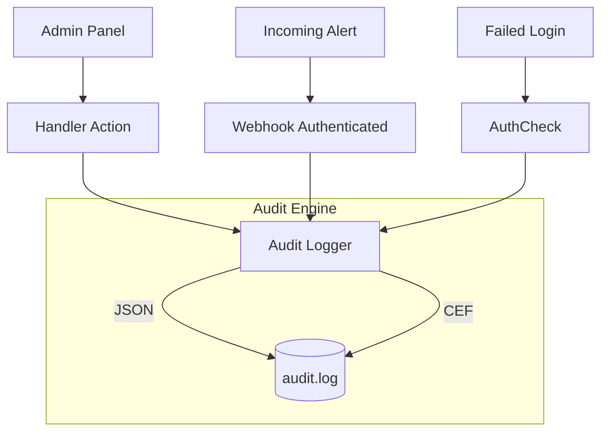

# Audit Logging (`audit`)

The `audit` package provides structured audit logging designed specifically for security and SIEM (Security Information and Event Management) integration. Unlike the application history logs (`history`), which track alert flows, audit logs track administrative actions and critical security events.

## Overview

## `audit.Logger` (Struct)

Writes audit events to a file in a thread-safe manner.

### `New(cfg)`
*   **Fast Track:** Initializes the audit logger if enabled.
*   **Deep Dive:**
    - **Parameters:** `cfg` (Config).
    - **Returns:** `(*Logger, error)`.
    - **Behavior:** Creates the target file in append mode. If `cfg.Enabled` is false, it returns a no-op logger. Supports two distinct output formats: `json` or `cef` (Common Event Format).

### `(l *Logger).Log(event)`
*   **Fast Track:** Writes a single `Event` to the audit log.
*   **Deep Dive:**
    - **Parameters:** `event` (Event).
    - **Behavior:** Takes a `models.Event` which classifies the action. It serializes the event to the requested format (JSON or CEF) and performs an atomic write using a mutex lock.

### `(l *Logger).Close()`
*   **Fast Track:** Shuts down the audit logger.
*   **Deep Dive:** Closes the underlying log file handle.

---

## Data Structures

### `audit.Event` (Struct)
*   **Fast Track:** Represents a single audit log entry.
*   **Deep Dive:**
    - **Fields:**
        - `Timestamp` (time.Time): Event time (UTC).
        - `EventType` (EventType): Category of the event.
        - `Severity` (Severity): Integer level (1-9).
        - `Source` (string): Target source/tenant ID.
        - `Actor` (string): Username or system component that performed the action.
        - `RemoteAddr` (string): IP address of the requester.
        - `Resource` (string): The object being acted upon (e.g., service name, target ID).
        - `Action` (string): Human-readable description of the action.
        - `Outcome` (string): "success" or "failure".
        - `Details` (map[string]string): Additional context.
        - `RequestID` (string): Unique identifier for tracing.

### `audit.EventType` (String Enum)
*   **Values:** `auth.success`, `auth.failure`, `webhook.received`, `status.change`, `service.create`, `service.delete`, `admin.action`, `queue.retry`, `health.check`, `config.change`.

### `audit.Severity` (Integer Enum)
*   **Values:**
    - `SevInfo` (1): Routine information.
    - `SevLow` (3): Minor security events.
    - `SevMedium` (5): Significant changes or repeated minor events.
    - `SevHigh` (7): Critical failures or high-risk actions.
    - `SevCritical` (9): Immediate attention required (e.g., brute force detected).

---

## CEF Format Details

When using the `cef` format, the logger maps `audit.Event` fields to ArcSight standardized keys:
- `rt`: Timestamp
- `src`: RemoteAddr
- `suser`: Actor
- `act`: Action
- `outcome`: Outcome
- `cs1`: Resource
- `cs2`: RequestID
- `cs3`: Source
