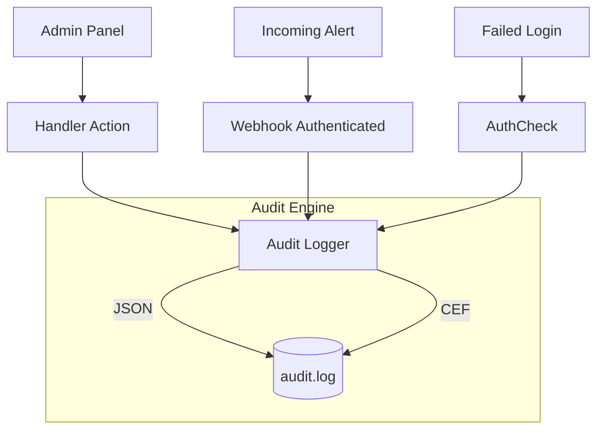

# Audit Logging (`audit`)

The `audit` package provides structured audit logging designed specifically for security and SIEM (Security Information and Event Management) integration. Unlike the application history logs (`history`), which track alert flows, audit logs track administrative actions and critical security events.

## Overview

## `Logger`

### `New(cfg)`
*   **Fast Track:** Initializes the audit logger if enabled.
*   **Deep Dive:** Creates the target file in append mode. Supports two distinct output formats: `json` or `cef` (Common Event Format).

### `Log(event)`
*   **Fast Track:** Writes a single `Event` to the audit log.
*   **Deep Dive:** Takes a `models.Event` which classifies `EventType` (e.g., `auth.success`, `webhook.received`, `admin.action`), `Severity` (from `SevInfo` to `SevCritical`), and details like `Actor`, `RemoteAddr`, and `Action`. It serializes to the requested format and acquires a lock to ensure atomic writes.

### `formatCEF(e)`
*   **Fast Track:** Converts an audit event into the ArcSight Common Event Format.
*   **Deep Dive:** Maps fields to CEF standardized keys.
    *   `Device Vendor`: IcingaAlertForge
    *   `Device Product`: WebhookBridge
    *   `Device Version`: 1.0
    *   `Signature ID`: `e.EventType`
    *   `Name`: `e.Action`
    *   `Severity`: integer mapping.
    *   Extensions: `rt` (timestamp), `src` (RemoteAddr), `act` (Action), `outcome` (success/failure), `suser` (Actor), `cs1` (Resource), `cs2` (RequestID).