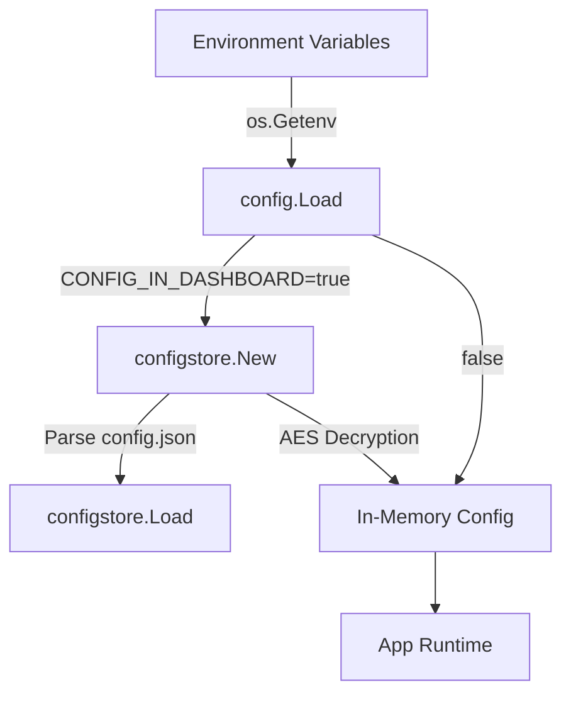

# Configuration (`config`, `configstore`)

This document describes how IcingaAlertForge manages its configuration, both via environment variables (`config`) and its persistent JSON dashboard mode (`configstore`).

## Configuration Architecture

IcingaAlertForge supports two configuration modes:
1.  **Environment Variables:** The traditional Docker-friendly way where settings are read from `.env` or the system.
2.  **Dashboard Store (`CONFIG_IN_DASHBOARD=true`):** A file-backed JSON store (`config.json`) where application settings are editable via the Web UI (Beauty Panel).

---

## The `config` Package

### `config.Load()`
*   **Fast Track:** Reads environment variables (and optionally a local `.env` file) and parses them into a `*Config` struct.
*   **Deep Dive:** Uses `godotenv.Load()` as a fallback. It parses complex multi-target variables (e.g., `IAF_TARGET_*`) and legacy single-target ones (`WEBHOOK_KEY_*`). It enforces required fields like `ICINGA2_HOST` and panics if validation fails.

### `loadTargetsAndRoutes()`
*   **Fast Track:** Parses the complex `IAF_TARGET_*` environment variables to build the internal mapping of Webhook API Keys to Icinga Hosts.
*   **Deep Dive:** Iterates through `os.Environ()`. It maps keys to sources and targets. If no `IAF_TARGET_*` variables are found, it falls back to `loadLegacyTargetAndRoutes()` for backward compatibility. It handles deduplication of API keys across multiple targets (fatal error if duplicated).

---

## The `configstore` Package

When the "Beauty Panel" config management is enabled, `configstore` takes over. It persists the `config.Config` into a structured JSON file. Crucially, it encrypts sensitive data (Icinga2 passwords, webhook API keys) at rest using AES-256-GCM.

### `configstore.New(configPath, encryptionKey)`
*   **Fast Track:** Initializes a new configuration store.
*   **Deep Dive:** Creates the directory for the config file if it doesn't exist. If an `encryptionKey` is provided, it derives a 256-bit AES key. If empty, it calls `loadOrCreateKey()` which generates a secure random 32-byte key and stores it in a hidden `.config.key` file alongside `config.json`.

### `(s *Store).MigrateFromEnv(cfg *config.Config)`
*   **Fast Track:** Bootstraps the JSON config file using the environment variables.
*   **Deep Dive:** Called on the very first startup when `CONFIG_IN_DASHBOARD=true` but `config.json` doesn't exist. It serializes the in-memory config to JSON and encrypts secrets, ensuring a seamless upgrade path from environment-only deployments.

### `(s *Store).Load() / (s *Store).Save()`
*   **Fast Track:** Reads from or writes to the persistent JSON file.
*   **Deep Dive:** `Load()` unmarshals the JSON and calls the internal `decrypt()` method on all secrets. `Save()` deep-copies the current in-memory config, calls `encrypt()` on the secrets, and performs an atomic write (writes to a `.tmp` file, then renames it) to prevent corruption if the server crashes during save.

### `(s *Store).ToConfig(serverPort, serverHost)`
*   **Fast Track:** Converts the stored JSON configuration back into a `*config.Config` object usable by the rest of the application.
*   **Deep Dive:** Reconstructs the `Targets` map and `WebhookRoutes` map from the serialized arrays. It injects infrastructure-level overrides (like `serverPort` and `serverHost`) since these cannot be changed via the dashboard and must always come from the environment.

### `(s *Store).encrypt(plaintext)` / `(s *Store).decrypt(ciphertext)`
*   **Fast Track:** Secures sensitive data at rest.
*   **Deep Dive:** Uses `crypto/aes` and `crypto/cipher` with GCM mode. Encrypted strings are prefixed with `enc:` and then hex-encoded. The `decrypt` function is backwards-compatible; if a string doesn't start with `enc:`, it returns it as plaintext (useful for manual migration or initial imports).