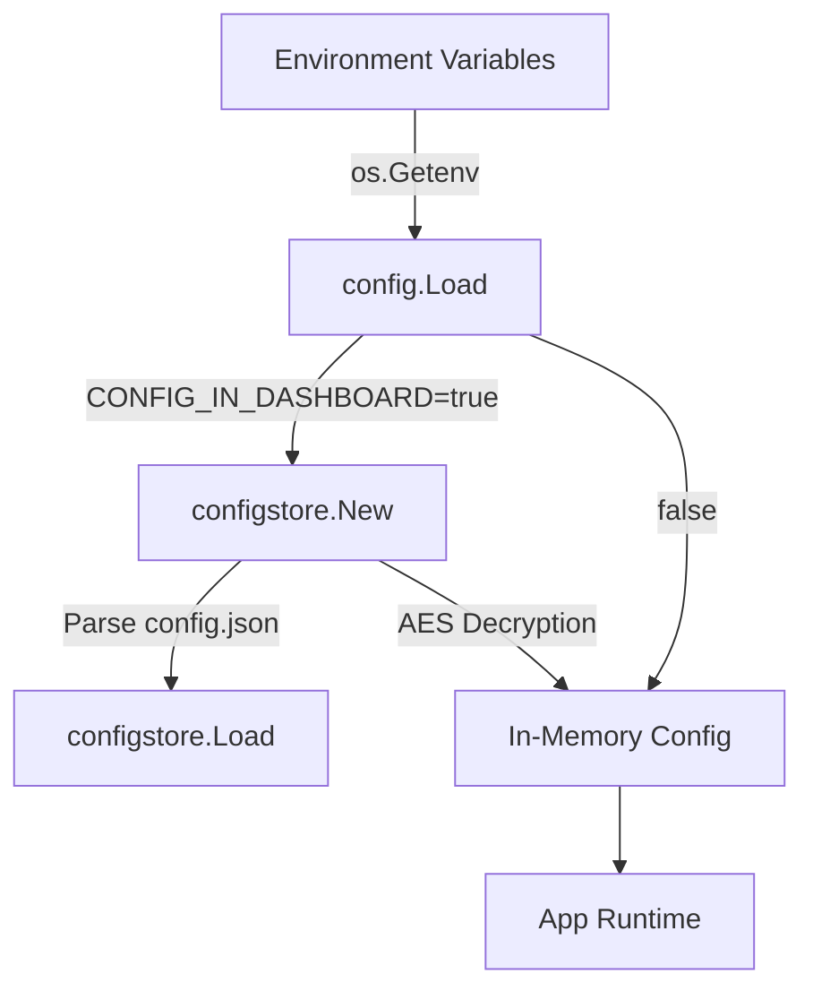

# Configuration (`config`, `configstore`)

This document describes how IcingaAlertForge manages its configuration, both via environment variables (`config`) and its persistent JSON dashboard mode (`configstore`).

## Configuration Architecture

IcingaAlertForge supports two configuration modes:
1.  **Environment Variables:** The traditional Docker-friendly way where settings are read from `.env` or the system.
2.  **Dashboard Store (`CONFIG_IN_DASHBOARD=true`):** A file-backed JSON store (`config.json`) where application settings are editable via the Web UI (Beauty Panel).

---

## The `config` Package

The `config` package handles the initial loading of settings from the environment.

### `config.Config` (Struct)
*   **Fast Track:** The central configuration object used by the application.
*   **Deep Dive:** Holds all settings including server details, Icinga2 credentials, target definitions, history settings, and feature flags (retry queue, health check, audit log). It also tracks whether the application is in `ConfigInDashboard` mode.

### `config.Load()`
*   **Fast Track:** Reads environment variables (and optionally a local `.env` file) and parses them into a `*Config` struct.
*   **Deep Dive:**
    - **Returns:** `(*Config, error)`.
    - **Behavior:** Uses `godotenv.Load()` as a fallback. It parses complex multi-target variables (e.g., `IAF_TARGET_*`) and legacy single-target ones (`WEBHOOK_KEY_*`). It enforces required fields like `ICINGA2_HOST`, `ICINGA2_USER`, and `ICINGA2_PASS`. It also provides sensible defaults for optional settings.

### `config.TargetConfig` (Struct)
*   **Fast Track:** Describes a single managed dummy host and its webhook routing.
*   **Deep Dive:** Contains `ID`, `Source`, `HostName`, `HostDisplay`, `HostAddress`, and a `NotificationConfig`. Each target represents a logical destination for alerts, usually mapping to a specific team or environment.

### `config.NotificationConfig` (Struct)
*   **Fast Track:** Holds per-target Icinga notification customization.
*   **Deep Dive:** Fields: `Users`, `Groups`, `ServiceStates`, `HostStates`. These are injected into the Icinga2 host object's custom variables, allowing for granular notification routing within Icinga2.

---

## The `configstore` Package

When the "Beauty Panel" config management is enabled, `configstore` takes over. It persists the configuration into a structured JSON file with AES encryption for secrets.

### `configstore.Store` (Struct)
*   **Fast Track:** Provides thread-safe persistent configuration storage.
*   **Deep Dive:** Manages the lifecycle of the `config.json` file. It handles encryption/decryption of sensitive fields and provides methods for RBAC user persistence.

### `configstore.New(configPath, encryptionKey)`
*   **Fast Track:** Initializes a new configuration store.
*   **Deep Dive:**
    - **Parameters:** `configPath` (string), `encryptionKey` (string).
    - **Returns:** `(*Store, error)`.
    - **Behavior:** Creates the directory for the config file if it doesn't exist. If an `encryptionKey` is provided via environment, it derives a 256-bit AES key. If empty, it generates a secure random 32-byte key and stores it in a hidden `.config.key` file alongside `config.json`.

### `(s *Store).Load()`
*   **Fast Track:** Reads the config from disk and decrypts secrets.
*   **Deep Dive:**
    - **Behavior:** Unmarshals the JSON file into a `StoredConfig` struct. It then iterates through the Icinga2 password, target API keys, and RBAC user passwords, calling `decrypt()` on each.

### `(s *Store).Save()`
*   **Fast Track:** Writes the current config to disk with secrets encrypted.
*   **Deep Dive:**
    - **Behavior:** Deep-copies the in-memory config to avoid mutating runtime state during encryption. Encrypts all sensitive fields. Performs an **atomic write** by writing to a `.tmp` file and then renaming it, ensuring the configuration isn't corrupted if the process is interrupted.

### `(s *Store).MigrateFromEnv(cfg *config.Config)`
*   **Fast Track:** Bootstraps the JSON config file using the environment variables.
*   **Deep Dive:**
    - **Parameters:** `cfg` (*config.Config).
    - **Behavior:** Called on the very first startup when `CONFIG_IN_DASHBOARD=true` but `config.json` doesn't exist. It serializes the provided env-based config to JSON and saves it, ensuring a seamless transition for existing deployments.

### `(s *Store).ToConfig(serverPort, serverHost)`
*   **Fast Track:** Converts the stored JSON configuration back into a `*config.Config` object usable by the rest of the application.
*   **Deep Dive:**
    - **Parameters:** `serverPort` (string), `serverHost` (string).
    - **Returns:** `*config.Config`.
    - **Behavior:** Reconstructs the `Targets` map and `WebhookRoutes` map from the serialized arrays. It injects infrastructure-level overrides (`serverPort`, `serverHost`) since these must remain controlled by the environment/orchestrator.

### `(s *Store).SetUsers(users) / (s *Store).GetUsers()`
*   **Fast Track:** Manages persistence for RBAC users.
*   **Deep Dive:** Allows the RBAC manager to store and retrieve non-primary users. Passwords are encrypted before being saved to the JSON file.

### `(s *Store).Export()`
*   **Fast Track:** Returns a JSON export suitable for backup.
*   **Deep Dive:** Returns the full configuration, including secrets in a format that can be re-imported. Used by the "Export Config" button in the admin dashboard.
