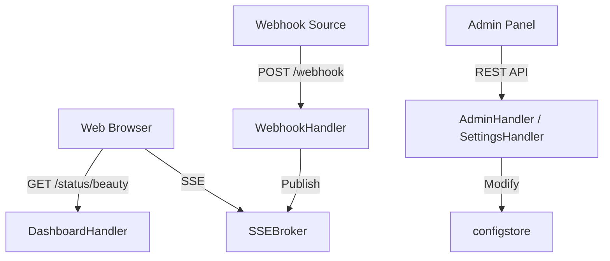

# HTTP Handlers (`handler`)

The `handler` package contains the HTTP endpoints that receive incoming webhooks, serve the LCARS-themed Beauty Panel dashboard, and provide the admin API.

## Overview

## `handler.WebhookHandler` (Struct)
*   **Endpoints:** `POST /webhook`
*   **Fast Track:** Ingests alerts from Grafana, Alertmanager, or custom scripts and routes them to Icinga2.
*   **Deep Dive:**
    - **Authentication:** Validates the `X-API-Key` header against the `KeyStore`.
    - **Payload Detection:** Inspects JSON keys to determine if the payload is from Grafana, Alertmanager, or a Universal format.
    - **Processing:** Normalizes alerts into `models.GrafanaPayload`. For each alert, it checks the `ServiceCache`; if it's a miss, it calls `icinga.CreateService`. Then it calls `icinga.SendCheckResult`.
    - **Rate Limiting:** Uses `icinga.RateLimiter` to prevent overwhelming the Icinga2 API.
    - **Side Effects:** Logs to `history.Logger`, updates `metrics.Collector`, publishes to `SSEBroker`, and records to `audit.Logger`.

## `handler.DashboardHandler` (Struct)
*   **Endpoints:** `GET /status/beauty`, `GET /status/beauty/logout`
*   **Fast Track:** Serves the LCARS-themed "Beauty Panel" dashboard.
*   **Deep Dive:**
    - **Authentication:** Uses HTTP Basic Auth. It checks for `?admin=1` to toggle administrative features.
    - **Data Aggregation:** Aggregates system stats, history stats, queue status, and health info into a `dashboardData` struct.
    - **Rendering:** Uses `html/template` to render the embedded HTML/JS/CSS.
    - **Logout:** Provides a `/logout` endpoint that clears Basic Auth by returning a `401 Unauthorized`.

## `handler.AdminHandler` (Struct)
*   **Endpoints:** `/admin/services`, `/admin/ratelimit`, `/admin/queue`, `/admin/users`, `/admin/history/clear`, `/admin/debug/toggle`
*   **Fast Track:** Provides a REST API for administrative operations.
*   **Deep Dive:**
    - **Service Management:** `HandleListServices`, `HandleDeleteService`, `HandleBulkDelete`, `HandleSetServiceStatus`.
    - **RBAC:** `HandleListUsers`, `HandleCreateUser`, `HandleDeleteUser`.
    - **Maintenance:** `HandleClearHistory`, `HandleQueueFlush`.
    - **Debug:** `HandleDebugToggle` enables/disables the outbound Icinga2 API capture.

## `handler.SettingsHandler` (Struct)
*   **Endpoints:** `/admin/settings`, `/admin/settings/targets`, `/admin/settings/test-icinga`, `/admin/settings/export`, `/admin/settings/import`
*   **Fast Track:** Manages the runtime configuration (active only when `CONFIG_IN_DASHBOARD=true`).
*   **Deep Dive:**
    - **Hot Reload:** When configuration is updated via `PATCH /admin/settings`, it triggers the `OnReload` callback to update the runtime state of other components (like `KeyStore` and `APIClient`) without a restart.
    - **Target Management:** Allows adding/deleting targets and generating API keys.
    - **Verification:** `HandleTestIcinga` verifies connectivity to Icinga2 using the current settings.

## `handler.StatusHandler` (Struct)
*   **Endpoints:** `GET /status/{service_name}`
*   **Fast Track:** Queries the current status of a specific service from both the cache and Icinga2.
*   **Deep Dive:** Returns a JSON response containing `cache_state`, `exists_in_icinga`, and `last_check_result` for triage.

## `handler.SSEBroker` (Struct)
*   **Endpoints:** `GET /status/beauty/events`
*   **Fast Track:** Manages Server-Sent Events (SSE) for real-time dashboard updates.
*   **Deep Dive:**
    - Maintains a thread-safe registry of connected clients.
    - `Publish(event)`: Pushes a JSON event (alert arrival, service creation) to all connected browsers.
    - `PublishRaw(event, data)`: Pushes pre-marshaled JSON data (e.g., from the `DebugRing`).
