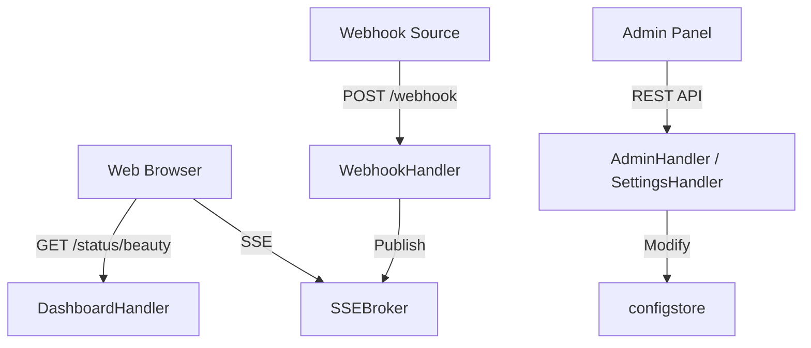

# HTTP Handlers (`handler`)

The `handler` package contains the HTTP endpoints that receive incoming webhooks, serve the LCARS-themed Beauty Panel dashboard, and provide the admin API.

## Overview

## `DashboardHandler` (`dashboard.go`)

### `ServeHTTP(w, r)`
*   **Fast Track:** Serves the HTML, CSS, and JS for the "Beauty Panel" dashboard.
*   **Deep Dive:**
    *   **Authentication Flow:** The dashboard uses HTTP Basic Auth. The handler checks the `?admin=1` query parameter to toggle between public read-only mode and authenticated command mode. It supports a clever logout mechanism via the `_logged_out` cookie, forcing the browser to clear cached Basic Auth credentials by returning a 401 Unauthorized response.
    *   **Data Aggregation:** It aggregates `SysStats`, `HistoryStats` (including complex groupings like Top IPs and Last IPs), `QueueStats`, and `HealthStatus` into a massive `dashboardData` struct.
    *   **Template Rendering:** The HTML, CSS, and JS are embedded directly in the Go binary as a string literal. It uses `html/template`.
    *   **Security (CSP):** Because the HTML file uses embedded `<style>` and `<script>` blocks, the `Content-Security-Policy` header configured in `main.go` *must* include `'unsafe-inline'` for `script-src` and `style-src`.
    *   **Secure JS Utility:** Contains the `escHtml(s)` JavaScript function which performs regex-based escaping of HTML entities (`&`, `<`, `>`, `"`, `'`) to prevent DOM-based XSS when rendering dynamic JSON/AJAX responses from the backend.

## `WebhookHandler` (`webhook.go`)

### `ServeHTTP(w, r)`
*   **Fast Track:** The primary ingestion point for all monitoring alerts.
*   **Deep Dive:**
    *   Authenticates via `X-API-Key` header against `auth.KeyStore`.
    *   Detects the payload format (Grafana, Alertmanager, or Universal) by inspecting JSON keys.
    *   Normalizes everything into `models.GrafanaPayload`.
    *   Iterates through each alert. If an alert is "firing", it creates the service in Icinga (if missing from `Cache`) and sends a CRITICAL/WARNING passive check result. If "resolved", it sends an OK result.
    *   Handles Rate Limiting using `icinga.RateLimiter`.
    *   Pushes events to the `HistoryLogger` and the `SSEBroker` for real-time UI updates.

## `SSEBroker` (`sse.go`)

*   **Fast Track:** Manages Server-Sent Events (SSE) connections for the real-time dashboard.
*   **Deep Dive:** Maintains a thread-safe map of active client channels. Exposes `Publish(event)` which pushes JSON strings to all connected dashboard clients. This powers the visual "Webhook Flow Line" and real-time alert table updates without requiring page reloads.

## `SettingsHandler` (`settings.go`)
*   **Fast Track:** Powers the in-dashboard configuration UI.
*   **Deep Dive:** Only active when `CONFIG_IN_DASHBOARD=true`. Allows patching the `StoredConfig`, adding targets, generating API keys, and triggering a hot-reload via the `OnReload` callback without restarting the Go process.