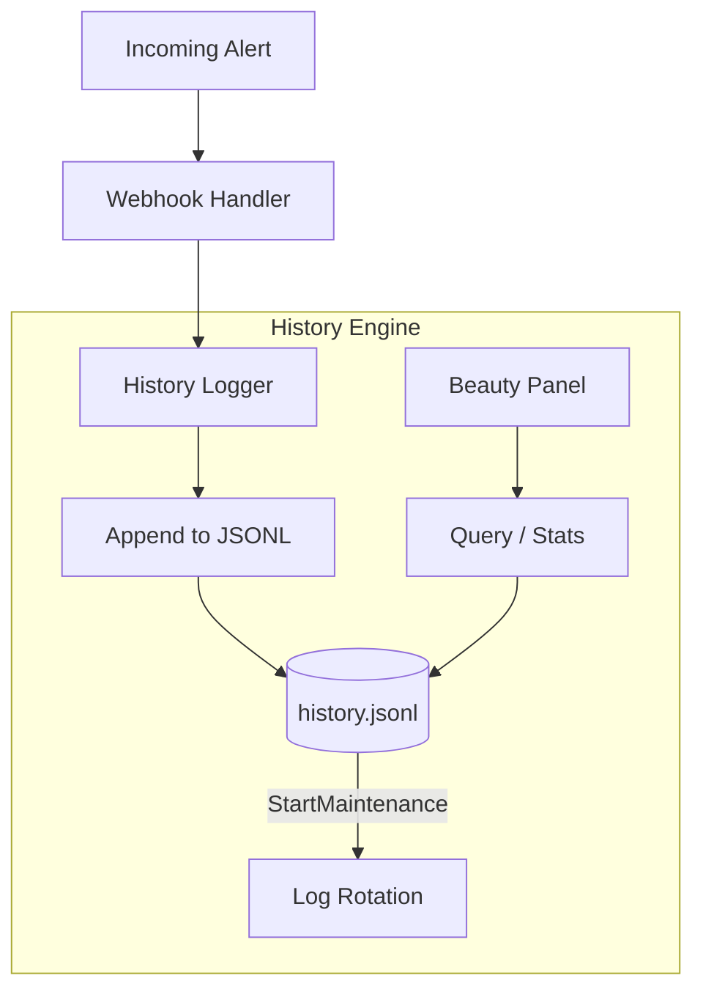

# Alert History (`history`)

The `history` package implements thread-safe JSONL file logging for all incoming webhooks, along with querying and statistical aggregation for the dashboard.

## Overview

## `Logger`

### `NewLogger(filePath, maxEntries)`
*   **Fast Track:** Initializes a file-based JSON Lines log.
*   **Deep Dive:** Ensures the target directory exists (`os.MkdirAll`). The logger is designed around append-only operations.

### `Append(entry)`
*   **Fast Track:** Writes a single `models.HistoryEntry` to the log.
*   **Deep Dive:** Takes a `Mutex` lock, opens the file in `O_APPEND|O_CREATE|O_WRONLY` mode, serializes the entry to JSON, and writes it with a newline. It uses an `atomic.Int64` counter (`appendCount`) to trigger an inline log rotation check every `N` appends (default 100), rather than spawning a goroutine on every write.

### `StartMaintenance(ctx)` & `Shutdown()`
*   **Fast Track:** Background routine to keep the history file size bounded.
*   **Deep Dive:** A ticker runs every 30 seconds to call `rotateIfNeeded()`. This ensures that even if traffic is low, the file never grows unbounded if `maxEntries` changes. The context ensures the goroutine stops cleanly on shutdown.

### `rotateLockedInline()`
*   **Fast Track:** Truncates the JSONL file.
*   **Deep Dive:** Reads all lines into memory. If `len(entries) > maxEntries`, it slices the array: `entries[len-max:]`. It then truncates the file and rewrites only the recent entries. This is an `O(N)` operation, hence why it runs infrequently.

### `Query(filter)`
*   **Fast Track:** Retrieves and filters history events for the UI.
*   **Deep Dive:** Reads the entire JSONL file (`readAll()`). Iterates through all entries and applies the `QueryFilter` (Limit, Service, Source, Host, Mode, From, To). Reverses the final list so the dashboard sees the newest events first.

### `Stats()`
*   **Fast Track:** Computes aggregate statistics for the admin dashboard.
*   **Deep Dive:** Reads all lines and builds `HistoryStats`. It counts events by Mode (test/firing), Action (create/delete), Severity, Source, and even aggregates the last seen IP addresses. It extracts the last 20 entries and the last 10 explicit errors (`IcingaOK == false`) for rapid triage in the Beauty Panel.