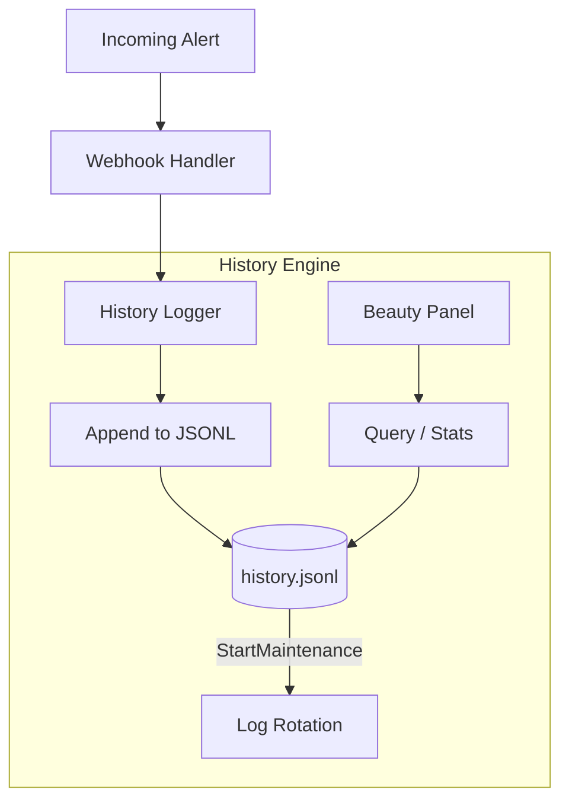

# Alert History (`history`)

The `history` package implements thread-safe JSONL file logging for all incoming webhooks, along with querying and statistical aggregation for the dashboard.

## Overview

## `history.Logger` (Struct)

Provides thread-safe JSONL history logging with rotation and filtering.

### `NewLogger(filePath, maxEntries)`
*   **Fast Track:** Initializes a file-based JSON Lines log.
*   **Deep Dive:**
    - **Parameters:** `filePath` (string), `maxEntries` (int).
    - **Returns:** `(*Logger, error)`.
    - **Behavior:** Ensures the target directory exists. The logger is optimized for append-only operations.

### `(l *Logger).Append(entry)`
*   **Fast Track:** Writes a single `models.HistoryEntry` to the log.
*   **Deep Dive:**
    - **Parameters:** `entry` (models.HistoryEntry).
    - **Behavior:** Thread-safe append to the JSONL file. It uses an `atomic.Int64` counter to trigger an inline rotation check every 100 appends.

### `(l *Logger).Query(filter)`
*   **Fast Track:** Retrieves and filters history events for the UI.
*   **Deep Dive:**
    - **Parameters:** `filter` (QueryFilter).
    - **Returns:** `([]models.HistoryEntry, error)`.
    - **Behavior:** Performs a streaming read of the JSONL file. If a `Limit` is set, it uses an internal **Ring Buffer** to efficiently collect the newest $N$ matches without loading the entire file into a standard slice. It reverses the final result so the newest events appear first.

### `(l *Logger).Stats()`
*   **Fast Track:** Computes aggregate statistics for the dashboard.
*   **Deep Dive:**
    - **Returns:** `(HistoryStats, error)`.
    - **Behavior:** Scans the entire history file and builds counts by mode, action, severity, and source. It also tracks the last seen IP addresses per source and identifies the 10 most recent errors.

### `(l *Logger).Clear()`
*   **Fast Track:** Truncates the history file, removing all entries.
*   **Deep Dive:** Safely truncates the file to 0 bytes and resets the internal append counter.

### `(l *Logger).StartMaintenance(ctx)`
*   **Fast Track:** Starts a background routine to ensure the history file size stays bounded.
*   **Deep Dive:** Runs a ticker (every 30s) that checks if the file exceeds `maxEntries` and performs a rotation if needed. This catches cases where `maxEntries` was lowered while the bridge was running.

---

## HTTP Handler

### `history.Handler` (Struct)
*   **Fast Track:** Provides HTTP endpoints for querying and exporting webhook history.
*   **Endpoints:**
    - `GET /history`: Supports query filters like `limit`, `service`, `source`, `host`, `mode`, `from`, and `to`.
    - `GET /history/export`: Streams the raw JSONL file as a download (`webhook-history.jsonl`).

---

## Data Structures

### `history.QueryFilter` (Struct)
*   **Fields:** `Limit` (int), `Service` (string), `Source` (string), `Host` (string), `Mode` (string), `From` (time.Time), `To` (time.Time).

### `history.HistoryStats` (Struct)
*   **Fields:** `TotalEntries`, `ByMode`, `ByAction`, `BySeverity`, `BySource`, `BySourceIP`, `ErrorCount`, `AvgDurationMs`, `RecentErrors`, `RecentEntries`.
