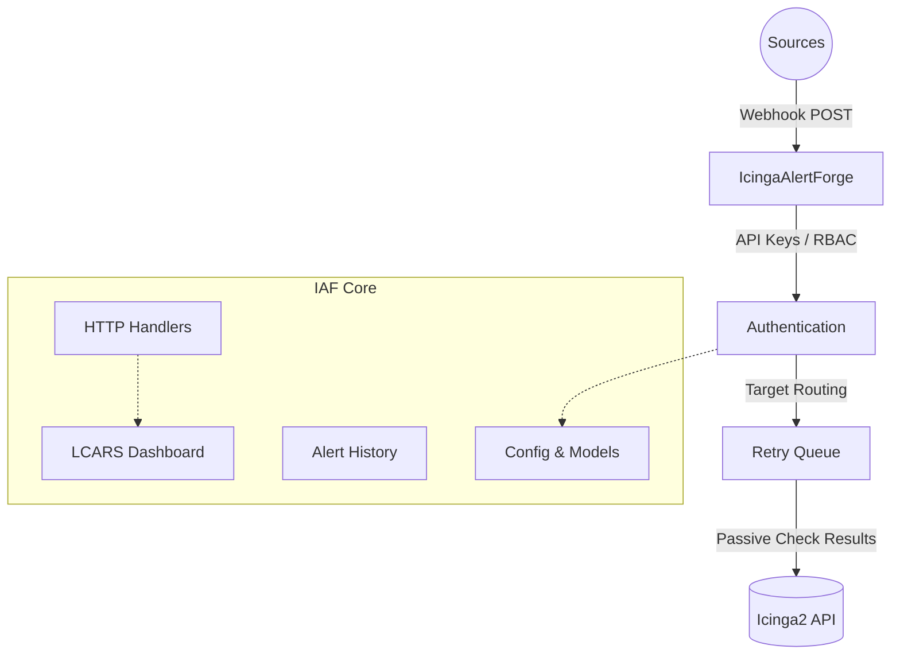

# IcingaAlertForge Wiki

Welcome to the **IcingaAlertForge** developer wiki! This documentation provides a deep, function-by-function breakdown of the codebase's main logic and exported APIs. It is designed to supplement the high-level user guides in `docs/` with technical implementation details.

## Quick Links
- [🚀 Installation Guide](Installation)
- [📊 Grafana Integration Setup](Grafana-Setup)

## Architecture Overview

IcingaAlertForge is a webhook-to-Icinga2 bridge that securely receives alerts from tools like Grafana and Alertmanager, and translates them into passive check results in Icinga2.

## Documentation Standards
Across this wiki, all functions and endpoints are documented with two specific sections:
*   **Fast Track:** A simple, high-level summary of what the function/module does.
*   **Deep Dive:** Detailed technical parameters, edge cases, and architectural context.

## Module Index

| Module | Scope | Status |
|---|---|---|
| [Main Lifecycle](Main) | `main.go` — startup, shutdown, signal handling | ✅ Completed |
| [Configuration](Config) | `config/`, `configstore/` — loading, encryption, persistence | ✅ Completed |
| [Data Models](Models) | `models/` — webhook payloads, history entries | ✅ Completed |
| [Icinga Integration](Icinga) | `icinga/` — API client, passive checks, object creation | ✅ Completed |
| [Retry Queue](Queue) | `queue/` — durable retry logic, exponential backoff | ✅ Completed |
| [Alert History](History) | `history/` — JSONL logging, query engine, stats | ✅ Completed |
| [Audit Logging](Audit) | `audit/` — security auditing, CEF format | ✅ Completed |
| [HTTP Handlers](Handler) | `handler/` — webhooks, beauty panel, admin API, SSE | ✅ Completed |
| [Security & Auth](Security) | `auth/`, `rbac/` — API keys, RBAC, constant-time auth | ✅ Completed |
| [Observability](Observability) | `health/`, `metrics/`, `cache/` — telemetry, cache, health check | ✅ Completed |
