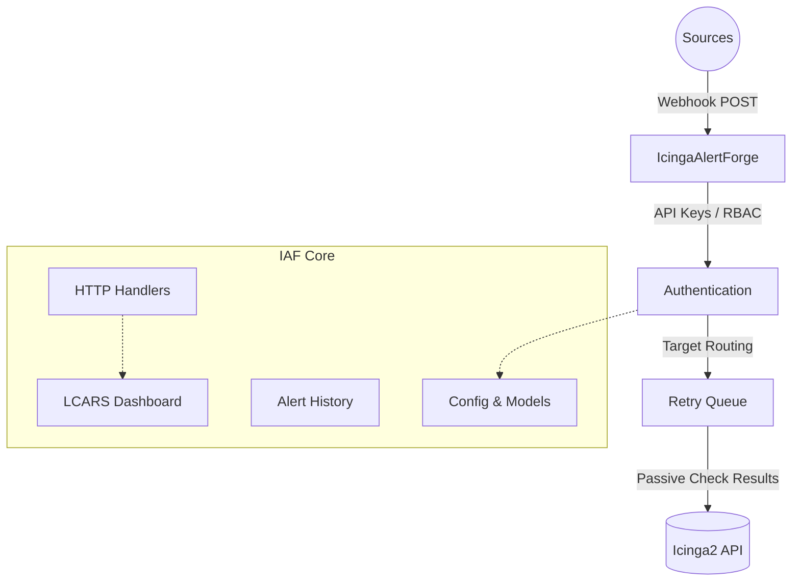

# IcingaAlertForge Wiki

Welcome to the **IcingaAlertForge** developer wiki! This documentation provides a deep, function-by-function breakdown of the codebase's main logic and exported APIs. It is designed to supplement the high-level user guides in `docs/` with technical implementation details.

## Architecture Overview

IcingaAlertForge is a webhook-to-Icinga2 bridge that securely receives alerts from tools like Grafana and Alertmanager, and translates them into passive check results in Icinga2.

## Documentation Standards
Across this wiki, all functions and endpoints are documented with two specific sections:
*   **Fast Track:** A simple, high-level summary of what the function/module does.
*   **Deep Dive:** Detailed technical parameters, edge cases, and architectural context.

## Module Index

*   **Core Foundation:**
    *   [Main Lifecycle (`main.go`)](Main.md)
    *   [Configuration (`config`, `configstore`)](Config.md)
    *   [Data Models (`models`)](Models.md)
*   **Integration and Processing:**
    *   [Icinga Integration (`icinga`)](Icinga.md)
    *   [Retry Queue (`queue`)](Queue.md)
    *   [Alert History (`history`)](History.md)
    *   [Audit Logging (`audit`)](Audit.md)
*   **Web and Security:**
    *   [HTTP Handlers & Dashboard (`handler`)](Handler.md)
    *   [Security & Auth (`auth`, `rbac`)](Security.md)
    *   [Observability (`health`, `metrics`, `cache`)](Observability.md)
