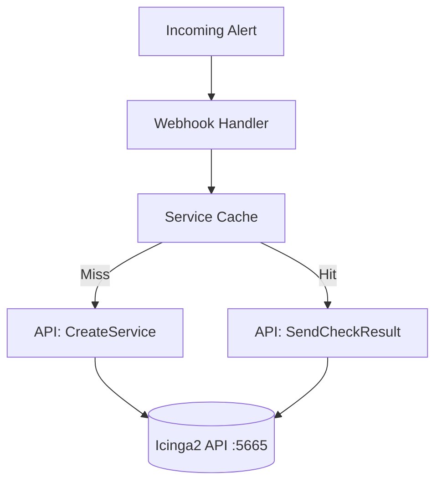

# Icinga Integration (`icinga`)

The `icinga` package contains the core API client used to communicate with the Icinga2 REST API. It handles creating hosts, creating services, and submitting passive check results.

## Overview

## `APIClient`

### `NewAPIClient(baseURL, user, pass, tlsSkipVerify)`
*   **Fast Track:** Initializes a robust HTTP client tailored for the Icinga2 API.
*   **Deep Dive:** Configures connection pooling, aggressively tuned timeouts (e.g., 5s handshake, 10s response), and optionally skips TLS verification. It holds a pointer to an optional `DebugRing` used by the realtime dashboard to broadcast raw HTTP requests/responses via SSE.

### `SendCheckResult(host, service, exitStatus, message)`
*   **Fast Track:** Submits a passive check result (OK/WARNING/CRITICAL) for a specific service.
*   **Deep Dive:** Hits `POST /v1/actions/process-check-result`. Constructs a payload with a service filter (`host.name=="..." && service.name=="..."`). Automatically logs the request/response to the `DebugRing`. Returns an error if the HTTP status is not 200 OK.

### `CreateHost(spec HostSpec)`
*   **Fast Track:** Creates a dummy host in Icinga2 to attach webhook alerts to.
*   **Deep Dive:** Uses `PUT /v1/objects/hosts/<hostname>`. Applies the `generic-host` template. Crucially, it injects custom variables: `vars.managed_by = "IcingaAlertingForge"`, `vars.iaf_managed = true`. It also maps notification users, groups, and state filters into the `vars.notification` structure so standard Icinga notification scripts apply.

### `CreateService(host, name, labels, annotations)`
*   **Fast Track:** Creates a new passive service on the target host.
*   **Deep Dive:** Uses `PUT /v1/objects/services/<host>!<service>`. Maps Grafana labels to `vars.grafana_label_*` and annotations to `vars.grafana_annotation_*`. It sets `enable_active_checks=false` and `enable_passive_checks=true`. Extracts `runbook_url` or `dashboard_url` and maps them to Icinga's native `notes_url` and `action_url` for UI integration.

### `GetHostInfo(host)` and `ListServices(host)`
*   **Fast Track:** Queries Icinga2 to discover existing infrastructure on startup.
*   **Deep Dive:** `ListServices` uses `POST /v1/objects/services` with an `X-HTTP-Method-Override: GET` header to pass a JSON filter payload. It checks for the IAF managed markers to populate the `cache.ServiceCache` and skip unnecessary service creation calls.