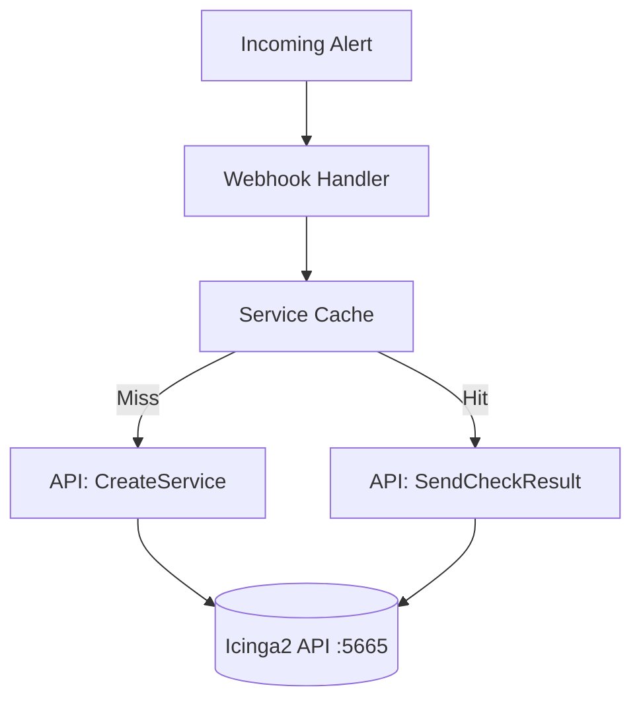

# Icinga Integration (`icinga`)

The `icinga` package contains the core API client used to communicate with the Icinga2 REST API. It handles creating hosts, creating services, and submitting passive check results.

## Overview

## `icinga.APIClient` (Struct)

The central client for interacting with Icinga2. It is thread-safe and supports hot-reloading of credentials.

### `NewAPIClient(baseURL, user, pass, tlsSkipVerify)`
*   **Fast Track:** Initializes a robust HTTP client tailored for the Icinga2 API.
*   **Deep Dive:**
    - **Parameters:** `baseURL` (string), `user` (string), `pass` (string), `tlsSkipVerify` (bool).
    - **Returns:** `*APIClient`.
    - **Behavior:** Configures a custom `http.Client` with aggressive timeouts (5s handshake, 10s response) and connection pooling.

### `(c *APIClient).UpdateCredentials(baseURL, user, pass, tlsSkipVerify)`
*   **Fast Track:** Replaces the client's connection details during a hot-reload.
*   **Deep Dive:** Uses a `sync.RWMutex` to safely update the client's configuration while other goroutines might be using it.

### `(c *APIClient).SendCheckResult(host, service, exitStatus, message)`
*   **Fast Track:** Submits a passive check result (OK/WARNING/CRITICAL) for a specific service.
*   **Deep Dive:**
    - **Parameters:** `host` (string), `service` (string), `exitStatus` (int), `message` (string).
    - **Behavior:** Hits `POST /v1/actions/process-check-result`. It uses a JSON filter to target the specific host and service.
    - **Error Conditions:** Returns an error if the API responds with a non-200 status code.

### `(c *APIClient).CreateHost(spec)`
*   **Fast Track:** Creates a dummy host in Icinga2 to attach webhook alerts to.
*   **Deep Dive:**
    - **Parameters:** `spec` (HostSpec).
    - **Behavior:** Uses `PUT /v1/objects/hosts/<hostname>`. It applies the `generic-host` template and sets `check_command` to `dummy`.
    - **Managed Markers:** Injects custom variables: `vars.managed_by = "IcingaAlertingForge"`, `vars.iaf_managed = true`.
    - **Notifications:** Maps notification users and groups into the `vars.notification` structure.

### `(c *APIClient).CreateService(host, name, labels, annotations)`
*   **Fast Track:** Creates a new passive service on the target host.
*   **Deep Dive:**
    - **Parameters:** `host` (string), `name` (string), `labels` (map[string]string), `annotations` (map[string]string).
    - **Behavior:** Uses `PUT /v1/objects/services/<host>!<service>`. Sets `enable_active_checks=false` and `enable_passive_checks=true`.
    - **Metadata Mapping:** Maps Grafana labels to `vars.grafana_label_*` and annotations to `vars.grafana_annotation_*`. Sets `notes_url` if a runbook or dashboard URL is provided in annotations.

### `(c *APIClient).DeleteService(host, name)`
*   **Fast Track:** Removes a service from Icinga2.
*   **Deep Dive:** Uses `DELETE /v1/objects/services/<host>!<service>?cascade=1`. It checks the conflict policy to ensure it doesn't delete services not managed by the bridge (unless `Force` is true).

### `(c *APIClient).ListServices(host)`
*   **Fast Track:** Returns all services for the given host from Icinga2.
*   **Deep Dive:**
    - **Returns:** `([]ServiceInfo, error)`.
    - **Behavior:** Uses `POST /v1/objects/services` with `X-HTTP-Method-Override: GET`. This allows passing a complex JSON filter to retrieve only services belonging to the target host.

---

## Support Types

### `icinga.ServiceInfo` (Struct)
*   **Fast Track:** Holds detailed information about an Icinga2 service.
*   **Deep Dive:** Fields include `HostName`, `Name`, `DisplayName`, `ManagedBy`, `ExitStatus`, `Output`, and `LastCheck`. It includes a helper `IsManagedByUs()` to check if the service carries the IAF marker.

### `icinga.HostInfo` (Struct)
*   **Fast Track:** Holds information about an Icinga2 host.
*   **Deep Dive:** Includes `Exists`, `CheckCommand`, `ManagedBy`, and `Address`.

### `icinga.ConflictPolicy` (Enum)
*   **Fast Track:** Defines how to handle objects that already exist but aren't managed by the bridge.
*   **Deep Dive:**
    - `skip`: Log a warning and do nothing.
    - `warn`: Proceed but log a warning.
    - `fail`: Stop and return an error.
