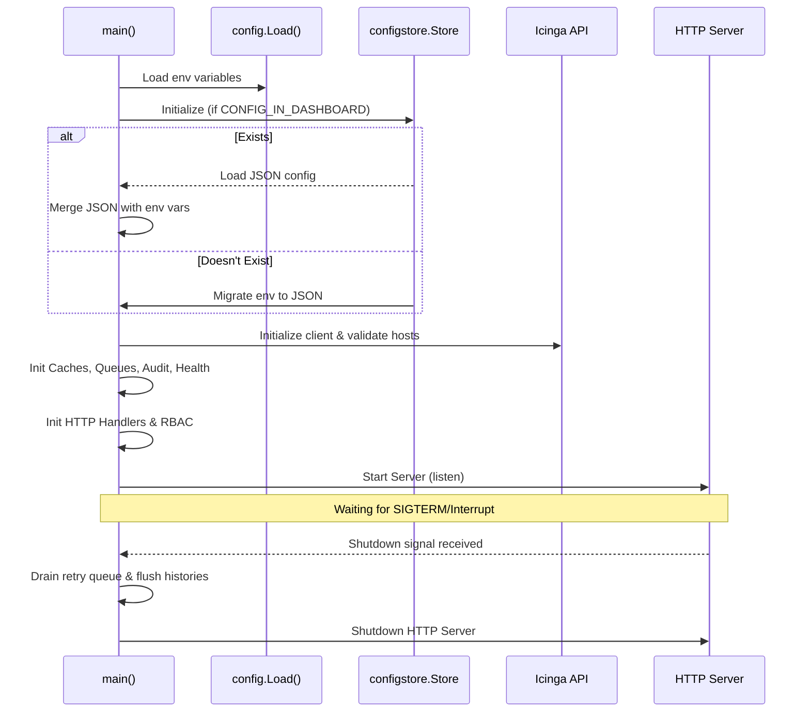

# Main Lifecycle (`main.go`)!

This document explains the lifecycle of the IcingaAlertForge application starting from the entry point in `main.go`.

## Architecture Diagram

The initialization sequence dictates how configuration is loaded, services are registered, and background jobs are spawned.

## Function Breakdown

### `main()`
*   **Fast Track:** The entry point of the application. It orchestrates the loading of configuration, initializes all internal modules (caches, queues, API clients), mounts HTTP routes, and starts the web server.
*   **Deep Dive:**
    *   **Configuration Merge:** It first loads environment variables via `config.Load()`. If `CONFIG_IN_DASHBOARD=true` is set, it initializes `configstore`. If a valid `config.json` exists, the JSON config supersedes the `.env` settings for application logic, leaving only infrastructure-level settings (like `SERVER_PORT` and `ADMIN_PASS`) to the environment.
    *   **Icinga Initialization:** Connects to the Icinga2 REST API. It triggers `ensureConfiguredHosts` to automatically create or validate target dummy hosts. Then it uses `restoreManagedServicesFromIcinga` to populate the internal service cache to avoid unnecessary duplicate creation calls.
    *   **Middleware & Routes:** Sets up rate limiters, an SSE broker for the realtime dashboard, HTTP Basic Auth and RBAC via `requireAuth`. Registers the `/webhook`, `/status/beauty`, and `/admin/*` endpoints.
    *   **Graceful Shutdown:** Listens for `SIGTERM`/`SIGINT`. On shutdown, it drains the retry queue, flushes the history logger, and allows in-flight HTTP requests 20 seconds to complete.

### `restoreManagedServicesFromIcinga(apiClient, serviceCache, host)`
*   **Fast Track:** Scans Icinga2 on startup to rebuild the internal cache of known services.
*   **Deep Dive:** Fetches all services attached to a given dummy host. It checks for the `managed_by: IcingaAlertForge` (or legacy) marker. This prevents the application from issuing a "Create Service" HTTP call to Icinga every time a webhook arrives for a known alert.

### `ensureConfiguredHosts(apiClient, targets, autoCreate)`
*   **Fast Track:** Checks if the target hosts exist in Icinga2, and creates them if they don't (and `autoCreate` is true).
*   **Deep Dive:** Iterates through all targets mapped in the configuration. For each, it queries Icinga2. If the host is missing and `ICINGA2_HOST_AUTO_CREATE=true`, it pushes a host creation payload using `toIcingaHostSpec`. It logs a conflict warning if the host exists but lacks the `managed_by: IcingaAlertForge` label, meaning it might have been provisioned by Icinga Director or manually.

### `setupLogging(level, format)`
*   **Fast Track:** Configures the global `slog` logger.
*   **Deep Dive:** Parses the configured log level (`debug`, `warn`, `error`, `info`) and format (`text` or `json`). Sets the default logger for the entire application.

### `icingaHealthAdapter`
*   **Fast Track:** An adapter bridging the Icinga2 API Client with the reverse Health Checker module.
*   **Deep Dive:** Implements `health.IcingaProber` to allow the internal health checking routine to create and update a self-monitoring service in Icinga without importing `icinga` packages directly into `health`.
