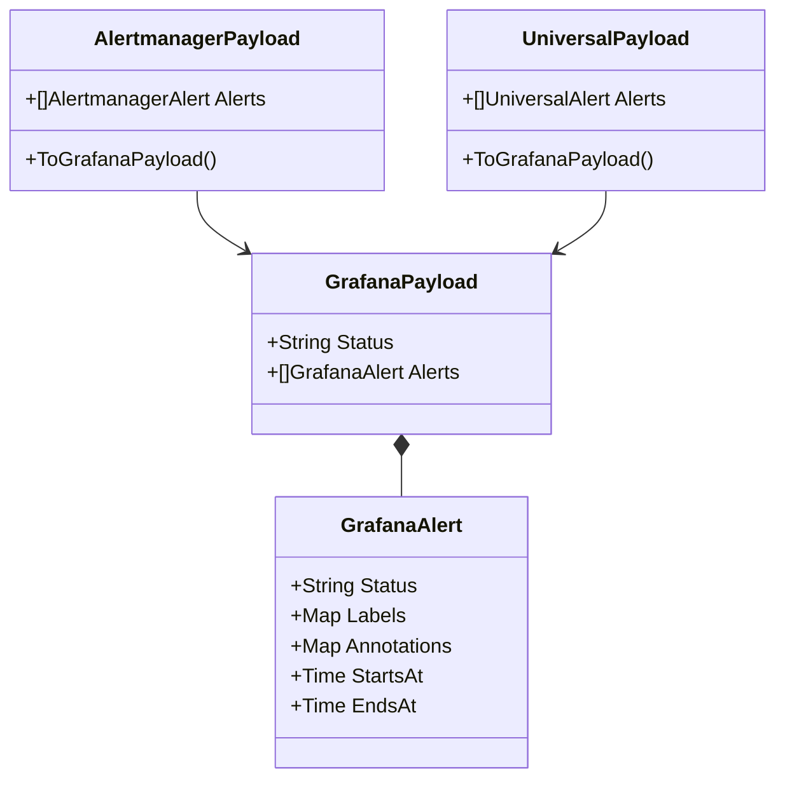

# Data Models (`models`)

The `models` package acts as the translation layer between external webhook payloads (Grafana, Alertmanager, custom tools) and the internal representation used by IcingaAlertForge.

---

## `GrafanaPayload` & `GrafanaAlert`
*   **Fast Track:** The native internal format for alerts.
*   **Deep Dive:** IcingaAlertForge internally normalizes all incoming webhooks into `GrafanaPayload`. It contains a `Status` (e.g., "firing" or "resolved") and an array of `GrafanaAlert` objects. Key methods on `GrafanaAlert` include `AlertName()` (extracts the Icinga2 service name), `Severity()` (extracts the warning/critical level), and `Summary()` (the human-readable message).

## `AlertmanagerPayload` & `AlertmanagerAlert`
*   **Fast Track:** Parses incoming webhooks from Prometheus Alertmanager.
*   **Deep Dive:** Maps the Alertmanager JSON schema (e.g., `GroupKey`, `Receiver`, `Alerts`). Provides a critical `ToGrafanaPayload()` method which translates `AlertmanagerAlert` structures into `GrafanaAlert` format so the main `WebhookHandler` can process them seamlessly.

## `UniversalPayload` & `UniversalAlert`
*   **Fast Track:** A simplified JSON structure for custom scripts and third-party integrations (e.g., CI/CD pipelines, IoT devices) that don't use Grafana or Alertmanager.
*   **Deep Dive:** Expects a simple `{"alerts": [{"name": "MyAlert", "status": "firing", "severity": "critical", "message": "Failed!"}]}`. Provides `ToGrafanaPayload()` which injects standard `Labels` and `Annotations` to simulate a Grafana alert.

## History Logs (`HistoryEntry`)
*   **Fast Track:** Defines the structure of recorded alert events in the persistent JSONL log.
*   **Deep Dive:** When a webhook is processed or fails, a `HistoryEntry` is generated. It tracks `ID`, `Timestamp`, `Source`, `Target`, `Payload`, `Result` (success, error), and `ProcessingTimeMs`. This model is deeply integrated with the `history` and `handler` packages for the Beauty Panel dashboard and CSV exports.