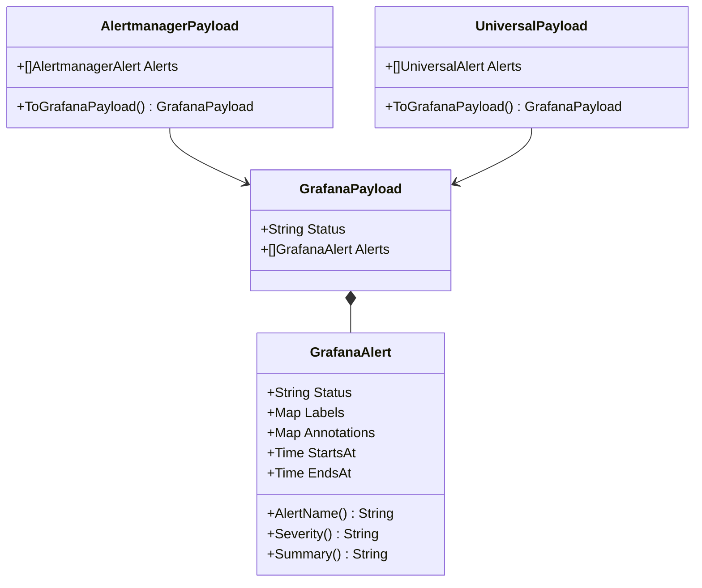

# Data Models (`models`)

The `models` package acts as the translation layer between external webhook payloads (Grafana, Alertmanager, custom tools) and the internal representation used by IcingaAlertForge.

---

## Webhook Payloads

### `models.GrafanaPayload` (Struct)
*   **Fast Track:** The native internal format for alerts, matching the Grafana Unified Alerting schema.
*   **Deep Dive:** IcingaAlertForge internally normalizes all incoming webhooks into this structure.
    - **Fields:**
        - `Status` (string): Overall status of the webhook (e.g., "firing", "resolved").
        - `Alerts` ([]GrafanaAlert): Slice of individual alerts.

### `models.GrafanaAlert` (Struct)
*   **Fast Track:** Represents a single alert within a payload.
*   **Deep Dive:**
    - **Fields:**
        - `Status` (string): Status of this specific alert.
        - `Labels` (map[string]string): Key-value pairs defining the alert context.
        - `Annotations` (map[string]string): Key-value pairs for human-readable metadata.
        - `StartsAt` (time.Time): When the alert started firing.
        - `EndsAt` (time.Time): When the alert was resolved.
    - **Methods:**
        - `AlertName()`: Returns the `alertname` label, which becomes the Icinga2 service name.
        - `Severity()`: Returns the `severity` label (e.g., "critical", "warning").
        - `Mode()`: Returns the `mode` label (e.g., "test").
        - `TestAction()`: Returns the `test_action` label (e.g., "create", "delete").
        - `Summary()`: Returns the `summary` annotation.
        - `IsTestMode()`: Returns true if `Mode()` is "test".

### `models.AlertmanagerPayload` (Struct)
*   **Fast Track:** Parses incoming webhooks from Prometheus Alertmanager.
*   **Deep Dive:**
    - **Methods:**
        - `ToGrafanaPayload()`: Translates the full Alertmanager structure into a `GrafanaPayload` for uniform processing by the bridge.

### `models.UniversalPayload` (Struct)
*   **Fast Track:** A simplified JSON structure for custom scripts and third-party integrations.
*   **Deep Dive:**
    - **Methods:**
        - `ToGrafanaPayload()`: Maps `Name`, `Status`, `Severity`, and `Message` into the standard `Labels` and `Annotations` of a `GrafanaPayload`.

---

## History and Events

### `models.HistoryEntry` (Struct)
*   **Fast Track:** Defines the structure of recorded alert events in the persistent JSONL log.
*   **Deep Dive:**
    - **Fields:**
        - `Timestamp` (time.Time): When the event was processed.
        - `RequestID` (string): Unique UUID for the webhook request.
        - `SourceKey` (string): The identifier of the API key used.
        - `HostName` (string): Target Icinga2 host.
        - `Mode` (string): "work" or "test".
        - `Action` (string): "firing", "resolved", "create", or "delete".
        - `ServiceName` (string): Icinga2 service name.
        - `Severity` (string): Alert severity level.
        - `ExitStatus` (int): Icinga2 exit code (0, 1, 2, 3).
        - `Message` (string): Human-readable output or error details.
        - `IcingaOK` (bool): True if the Icinga2 API call succeeded.
        - `DurationMs` (int64): Server-side processing time.
        - `Error` (string): Detailed error message if `IcingaOK` is false.
        - `RemoteAddr` (string): Source IP of the webhook request.
