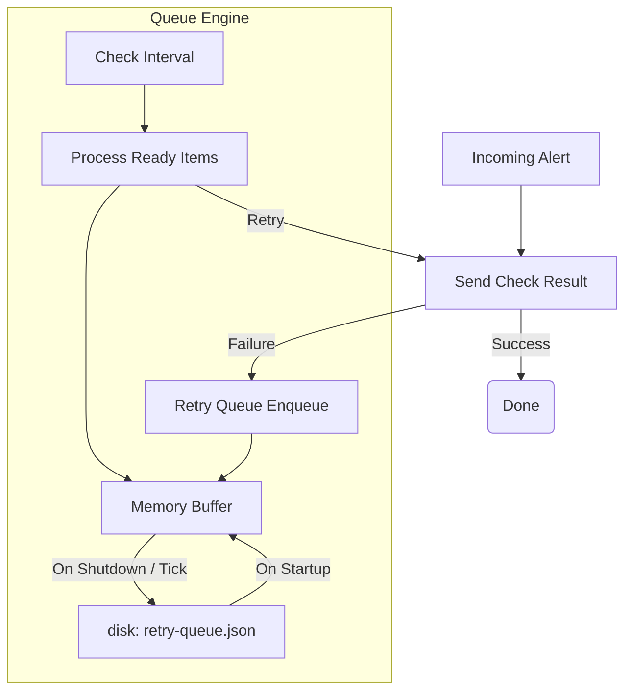

# Retry Queue (`queue`)

The `queue` package implements a durable retry buffer for passive check results that fail to reach Icinga2 (e.g., due to network partitions or Icinga2 restarts).

## Architecture

## `queue.Queue` (Struct)

Buffers failed Icinga2 check results and retries them with exponential backoff.

### `New(cfg, sender)`
*   **Fast Track:** Initializes the queue and optionally restores state from disk.
*   **Deep Dive:**
    - **Parameters:** `cfg` (Config), `sender` (CheckResultSender).
    - **Returns:** `*Queue`.
    - **Behavior:** If `cfg.FilePath` is set and exists, it calls `loadFromDisk()` to restore any items from a previous session.

### `(q *Queue).Start(ctx)`
*   **Fast Track:** Begins the background retry processor.
*   **Deep Dive:** Launches a goroutine that ticks every `CheckInterval` (default 10s) to evaluate queued items and attempt retries.

### `(q *Queue).Enqueue(item)`
*   **Fast Track:** Adds a failed check result to the back of the queue.
*   **Deep Dive:**
    - **Parameters:** `item` (Item).
    - **Behavior:** Thread-safe append to the in-memory buffer. If the queue is at `MaxSize`, it drops the *oldest* item to make room. It automatically sets the initial `NextRetry` based on `RetryBase`.

### `(q *Queue).Flush()`
*   **Fast Track:** Forces an immediate retry of all queued items.
*   **Deep Dive:**
    - **Returns:** `int` (number of successfully processed items).
    - **Behavior:** Resets `NextRetry` for all items to "now" and attempts to send them immediately. Successfully sent items are removed from the queue.

### `(q *Queue).Drain()`
*   **Fast Track:** Persists all in-memory items to disk for a graceful shutdown.
*   **Deep Dive:** Stops the background processor and marshals the `items` slice to the configured `FilePath`. This ensures no alerts are lost during bridge maintenance or restarts.

### `(q *Queue).Stats()`
*   **Fast Track:** Returns current queue statistics.
*   **Deep Dive:**
    - **Returns:** `Stats`.
    - **Behavior:** Returns a snapshot of queue depth, max size, total retried/dropped/failed counts, and whether the processor is currently active.

---

## Data Structures

### `queue.Item` (Struct)
*   **Fast Track:** Represents a single queued check result.
*   **Deep Dive:** Contains all context needed to retry the alert: `Host`, `Service`, `ExitStatus`, `Message`, `Source`, `RequestID`, `Attempts` (counter), and `NextRetry` (timestamp).

### `queue.Stats` (Struct)
*   **Fast Track:** Statistics for dashboard and API consumption.
*   **Deep Dive:** Includes `Depth`, `MaxSize`, `OldestItem`, `TotalRetried`, `TotalDropped`, `TotalFailed`, and `Processing` (boolean).

### `queue.Config` (Struct)
*   **Fast Track:** Configuration parameters for the queue.
*   **Deep Dive:**
    - `Enabled`: Whether the queue is active.
    - `MaxSize`: Limit of items in memory.
    - `FilePath`: Where to persist the queue on shutdown.
    - `RetryBase`: Initial backoff duration (e.g., 5s).
    - `RetryMax`: Maximum backoff duration (e.g., 5m).
    - `CheckInterval`: How often the background loop runs.
