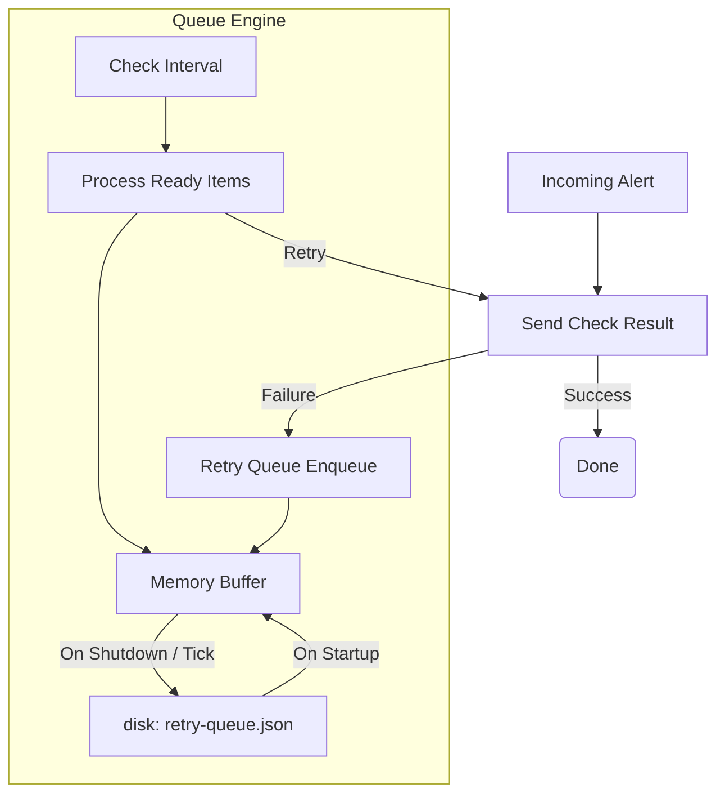

# Retry Queue (`queue`)

The `queue` package implements a durable retry buffer for passive check results that fail to reach Icinga2 (e.g., due to network partitions or Icinga2 restarts).

## Architecture

## `Queue`

### `New(cfg, sender)` / `Start(ctx)`
*   **Fast Track:** Initializes the queue and starts the background processor.
*   **Deep Dive:** Takes a `CheckResultSender` interface (implemented by `icinga.APIClient`). It immediately attempts to `loadFromDisk()` if a `FilePath` is configured. `Start` launches a goroutine that ticks every `CheckInterval` (default 10s) to evaluate queued items.

### `Enqueue(item)`
*   **Fast Track:** Adds a failed check result to the back of the queue.
*   **Deep Dive:** Locks the queue. If `len(items) >= MaxSize`, it drops the *oldest* item (`items[1:]`), preventing unbounded memory growth. It sets `Attempts = 0` and schedules the `NextRetry = time.Now() + RetryBase`. Returns `nil` even on drop (logged as a warning).

### `processor(ctx)` & `processReady()`
*   **Fast Track:** The core loop that retries items.
*   **Deep Dive:** On every tick, it scans the buffer for items where `NextRetry <= time.Now()`. It builds a list of `ready` items and releases the lock. It iterates over the ready list, calling `sender.SendCheckResult`.
    *   **Success:** It calls `removeByID(id)` and increments `totalRetried`.
    *   **Failure:** It calls `incrementAttempt(id)`.

### `backoff(attempts, base, max)`
*   **Fast Track:** Calculates exponential backoff.
*   **Deep Dive:** Implements exponential backoff: `base * 2^attempts`. It caps the duration at `max` (default 5 minutes).

### `Drain()`
*   **Fast Track:** Secures the queue during a graceful shutdown.
*   **Deep Dive:** Cancels the processor context, locks the queue, and writes all in-memory items to `FilePath` via `json.MarshalIndent`. This guarantees no alerts are lost if the IcingaAlertForge bridge is restarted while Icinga2 is down.