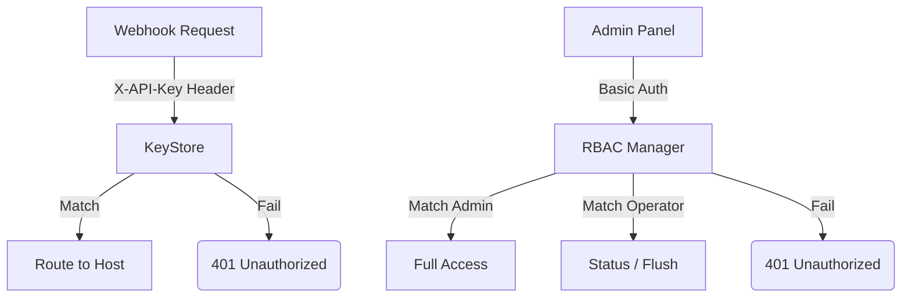

# Security & Auth (`auth`, `rbac`)

The `auth` and `rbac` packages govern all access controls in IcingaAlertForge.

## Authentication Overview

## `KeyStore` (`auth`)
### `ValidateKey(key)`
*   **Fast Track:** Checks if an incoming webhook API key is valid and returns its target routing rule.
*   **Deep Dive:** Crucially, this function uses `subtle.ConstantTimeCompare([]byte(keyBytes), []byte(k))` to iterate over all keys. This guarantees the execution time is identical regardless of how much of the API key matches, completely mitigating timing-based cryptographic side-channel attacks.

## `RBAC Manager` (`rbac`)
### `New(users)` & `Authenticate(user, pass)`
*   **Fast Track:** Handles the authentication of users attempting to access the Admin or Beauty Panel features.
*   **Deep Dive:** Supports an in-memory map of `rbac.User` objects. It is initialized with a primary "Admin" user loaded directly from environment variables (`ADMIN_USER`/`ADMIN_PASS`). Other users can be added dynamically and stored in `configstore`. Authentication also uses `subtle.ConstantTimeCompare`.

### `Authorize(role, perm)` & `HasPermission(user, perm)`
*   **Fast Track:** Checks if an authenticated user is allowed to perform a specific action.
*   **Deep Dive:** Defines three strict roles:
    1.  `RoleViewer`: Read-only (`PermViewDashboard`, `PermViewHistory`, `PermViewStatus`).
    2.  `RoleOperator`: Status manipulation (`PermChangeStatus`, `PermFlushQueue`, `PermClearHistory`).
    3.  `RoleAdmin`: Full control (`PermDeleteService`, `PermManageConfig`, `PermManageUsers`).
*   The `AdminHandler` and `DashboardHandler` heavily rely on these permission checks before executing destructive HTTP methods like `POST /admin/services/.../status` or `DELETE /admin/services/...`.