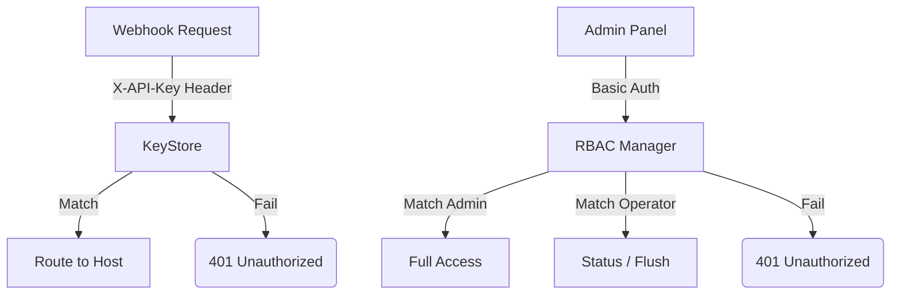

# Security & Auth (`auth`, `rbac`)

The `auth` and `rbac` packages govern all access controls in IcingaAlertForge.

## Authentication Overview

## `auth.KeyStore` (Struct)

Holds the mapping of API key values to their source identifiers and target hosts.

### `NewKeyStore(routes)`
*   **Fast Track:** Initializes a KeyStore from a mapping of API keys to route rules.
*   **Deep Dive:**
    - **Parameters:** `routes` (map[string]config.WebhookRoute).
    - **Returns:** `*KeyStore`.

### `(ks *KeyStore).ValidateKey(key)`
*   **Fast Track:** Checks if an incoming webhook API key is valid and returns its routing rule.
*   **Deep Dive:**
    - **Parameters:** `key` (string).
    - **Returns:** `(config.WebhookRoute, bool)`.
    - **Security:** Crucially, this function uses `subtle.ConstantTimeCompare` to iterate over all keys. This guarantees that the execution time is identical regardless of how much of the API key matches, completely mitigating timing-based cryptographic side-channel attacks.

---

## `rbac.Manager` (Struct)

Handles user authentication and role-based authorization for the admin dashboard and Beauty Panel.

### `New(users)`
*   **Fast Track:** Creates a new RBAC manager with a predefined set of users.
*   **Deep Dive:**
    - **Parameters:** `users` ([]User).
    - **Returns:** `*Manager`.
    - **Behavior:** Initializes an internal map of users.

### `(m *Manager).Authenticate(username, password)`
*   **Fast Track:** Validates credentials and returns the user object.
*   **Deep Dive:**
    - **Parameters:** `username` (string), `password` (string).
    - **Returns:** `(User, bool)`.
    - **Security:** Supports both hashed passwords (stored as `salt:hash`) and plaintext (for primary environment-based admins). Uses constant-time comparison for all password checks.

### `(m *Manager).Authorize(role, permission)`
*   **Fast Track:** Checks if a specific role is allowed to perform an action.
*   **Deep Dive:**
    - **Parameters:** `role` (Role), `permission` (Permission).
    - **Returns:** `bool`.
    - **Logic:** Consults a static mapping of roles to permissions.

### `(m *Manager).AddUser(user) / (m *Manager).RemoveUser(username)`
*   **Fast Track:** Manages the user database.
*   **Deep Dive:**
    - **AddUser:** Hashes the password if provided in plaintext and stores the user. Triggers a persistence callback if configured.
    - **RemoveUser:** Deletes a user. Prevents the deletion of the "Primary Admin" (the user defined via `ADMIN_USER` environment variable).

---

## Roles and Permissions

### `rbac.Role` (Enum)
1.  **`viewer`**: Read-only access to dashboard, history, and status.
2.  **`operator`**: Viewer + ability to change service status, flush queues, clear history, and toggle debug capture.
3.  **`admin`**: Full access including settings, user management, and service deletion.

### `rbac.Permission` (Constants)
- `view.dashboard`, `view.history`, `view.status`, `view.queue`
- `change.status`, `flush.queue`, `clear.history`, `debug.toggle`
- `delete.service`, `manage.config`, `manage.users`
